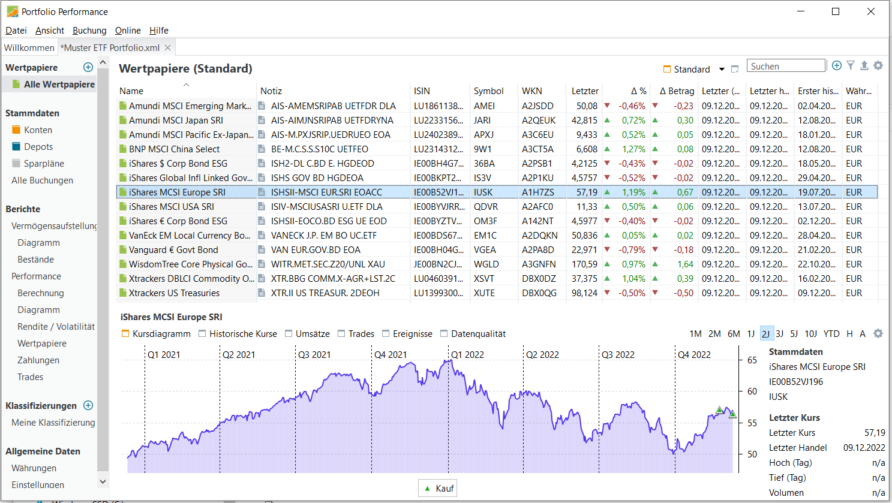

# Wertpapiere erstmalig anlegen

Aus der großen Menge aller möglichen Wertpapiere sind nur wenige für dich relevant - weil du sie im Bestand hast, sie kaufen möchtest oder als Referenz verfolgen willst.

Deshalb stellst du hier deine persönliche Liste der für dich relevanten Wertpapiere zusammen. Du kannst beliebige Wertpapiere in die Wertpapierliste aufnehmen, unabhängig davon, ob du diese Wertpapiere in deinen Depots hast oder nicht.

## Wertpapiere zum Portfolio hinzufügen

Abbildung: neues Wertpapier zum Portfolio hinzufügen.{class=align-center}

Um neue Wertepapiere zum Portfolio hinzuzufügen, wählst du `Wertpapiere > alle Wertpapiere` links in der Navigationsleiste und klicken dann auf das `+` Zeichen ***ganz rechts oben neben dem Feld Suchen*** , dann `Neues Wertpapier`wählen. Anmerkung: Es gibt auch ein kleines `+` Zeichen links über "alle Wertpapiere", das ist aber nicht das richtige.

Jetzt gibst du im Suchfeld den Namen, die ISIN oder WKN ein. Klicke `Suchen`. Das Wertpapier erscheint in der Ergebnisliste und kann mit `Übernehmen` ausgewählt werden. Die Stammdaten zum ausgewählten Wertpapier werden nachfolgend angezeigt, mit `OK` wird das Wertpapier in die Wertpapierliste übernommen.

Dabei ergänzt *Portfolio Performance* die Stammdaten, aktuelle und historische Kurse mit Informationen aus dem Internet.

## Wertpapiernamen anpassen

Abbildung: Die Wertpapierliste nach dem Hinzufügen von Wertpapieren.{class=align-center}

So sieht die Wertpapierliste aus, nachdem du eine Reihe von Wertpapieren hinzugefügt hast.

In diesem Fall sind die von *Portfolio Performance* vorgeschlagenen Namen der Wertpapiere nicht einfach verständlich. Es sind aber dieselben Namen, die auch im Online-Banking angezeigt werden (zumindest bei ING). Daher ist es eine gute Idee, die automatisch erzeugten Namen in die Spalte Notiz zu kopieren, und dann den Namen in der ersten Spalte mit einem aussagekräftigen Namen zu überschreiben. Die Tabellenfelder kannst du direkt mit Doppelklick selektieren, dann kannst du mit `Ctrl-C / Ctrl-V` kopieren und einfügen.

## Die fertige Wertpapierliste

Abbildung: Die fertige Wertpapierliste.{class=align-center}

Die fertige Wertpapierliste enthält die ausgewählten Wertpapiere mit den Stammdaten sowie den letzten Kursen und Kursbewegungen zum Vortag. Bei Auswahl eines Wertpapiers zeigt *Portfolio Performance* im unteren Teil den Kursverlauf und den aktuellen Kurs an.
