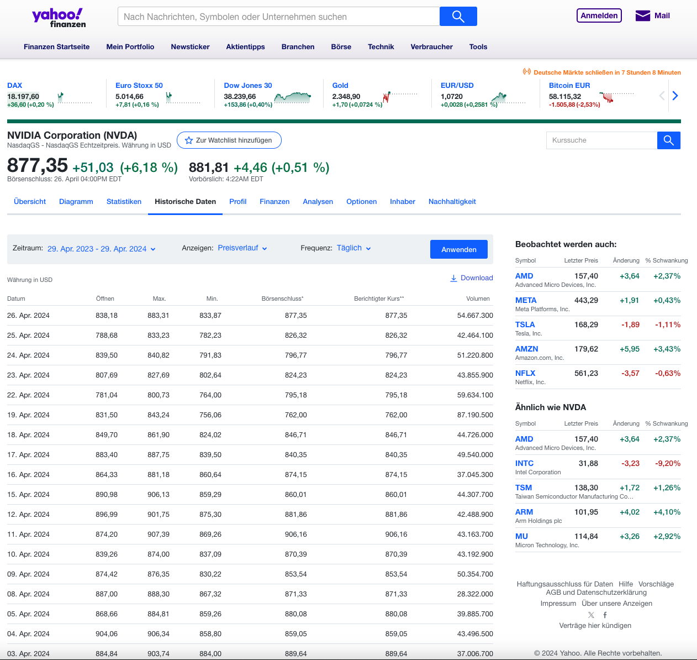

In Portfolio Performance ist das Importieren von historischen Kursen aus einer CSV-Datei ein einfacher Vorgang über das Menü `Datei > Importieren > CSV-Dateien`. Für diesen Vorgang benötigst du natürlich eine Datei, die die entsprechenden Daten enthält.

Eine csv-Datei ist eine kommagetrennte Textdatei, in der tabellarische Daten gespeichert werden. Jede Zeile in der Datei stellt einen Datensatz dar, und jede Spalte steht für ein Feld. Eine typische CSV-Datei mit historischen Kursen enthält zum Beispiel zwei Spalten (Datum und Kurs) und mehrere Zeilen, eine für jedes Datum mit dem entsprechenden historischen Kurs. Eine csv-Datei kann mit einer Tabellenkalkulationssoftware geöffnet und bearbeitet werden. Der Import in Portfolio Performance funktioniert damit ganz leicht.

Jede Website kann eine eigene Vorgehensweise für das Herunterladen einer CSV-Datei mit historischen Daten haben. In der Regel musst du zu dem gewünschten Wertpapier navigieren und den Download-Link auf dieser Webseite finden. Viele Websites erfordern für das Herunterladen eine (kostenlose) Registrierung, wobei Yahoo Finance eine Ausnahme bildet.

Es ist wichtig zu beachten, dass diese Methode nur eine Momentaufnahme der historischen Kurse liefert. Um die Kurse von morgen zu erhalten, musst du den Vorgang wiederholen. In der Praxis musst du diesen Ansatz mit einer der Methoden zum automatischen Herunterladen von Kursen kombinieren. Dendaran, dass du [die vorhandenen historischen Kurse](../../reference/file/images/mnu-file-import-reload-quotes.png) in Portfolio Performance behalten kannst, auch wenn du den Kursanbieter auf automatischen Download umstellst.  In den beiden folgenden Szenarien kannst du beispielsweise nach dem Import der CSV-Datei den Kurs-Anbieter auf [Tabelle auf einer Website](./table-website.md) einstellen, um die historischen Kurse täglich zu aktualisieren.

## Yahoo Finance

Nachdem du zu [Yahoo Finance](https://finance.yahoo.com) navigiert bist, kannst du den Namen "NVIDIA" in das Suchfeld oben auf dem Bildschirm eingeben (siehe Abbildung 1). Wähle die Registerkarte "Historische Kurse" in der Mitte des Bildschirms. 
Hier kannst du jetzt den Zeitraum und die Frequenz wählen, bevor du eine CSV-Datei mit historischen Kursen herunterlädst. Importiere dies CSV-Datei über das Menü "Datei > Importieren > CSV-Dateien" in Portfolio Performance, wähle die Option Historische Kurse und ordne sie dem richtigen Wertpapier zu.

Abbildung: Webseite von finance.yahoo.com zum Download für historische Kurse von NVIDIA.{class=pp-figure}

Wenn du mit der Maus über das Download Symbol gehst, findest du am unteren Bildschirmrand die URL.

`https://query1.finance.yahoo.com/v7/finance/download/NVDA?period1=1674359406&period2=1705895406&interval=1d&events=history&includeAdjustedClose=true`

Das ist die Anfrage, die an den Yahoo-Server gesendet wird. Sie enthält das Tickersymbol des Wertpapiers (NVDA), den Zeitraum, ausgedrückt als Unix-Zeitstempel oder die Anzahl der Sekunden, die seit dem 1. Januar 1970 verstrichen sind, die Frequenz oder das Intervall (1d), die Art der gewünschten Informationen (events=history) und den angepassten Schlusskurs. Die CSV-Datei enthält 7 Spalten: Datum, Open, High, Low, Close, Volumen und Adj Close.

Du kannst diese URL ändern, um andere Ergebnisse zu erhalten. Die folgende URL ruft zum Beispiel die Preise der letzten drei Monate ab (die Spalten bleiben gleich):

`https://query1.finance.yahoo.com/v7/finance/download/NVDA?range=3mo&interval=1d`

## Investing.com

Investing.com ist eine umfassende Finanzwebsite mit Echtzeitkursen, Finanznachrichten, Analysen und Tools für Anleger. Hier kannst du nach mehr als 30 Ländern filtern, das ganze auch in unterschiedlichen europäischen Sprachen.

Wenn du auf das Suchfeld klickst, werden deine letzten Suchanfragen und die beliebtesten Suchanfragen angezeigt. Du kannst den Namen, den Ticker oder die ISIN des Wertpapiers eingeben, an dem du interessiert bist. Es wird eine grafische Übersicht über die Kursentwicklung (1 Monat) angezeigt. Klicke auf `Historische Daten`, um die Tabelle zu sehen. Um deine Auswahl herunterladen zu können, benötigst musst du dich kostenlos mit deiner EMail-Adresse registrieren. Alle Daten können für einen Zeitraum von bis zu 20 Jahren heruntergeladen werden.