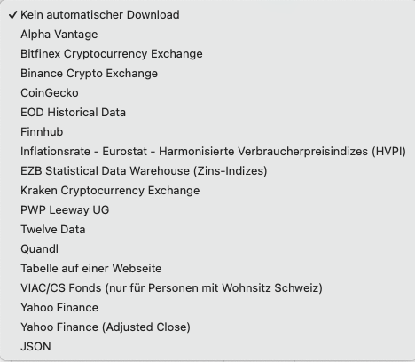

Abbildung: Documentation Framework.{class=align-right style="width:40%"}

Die Suche nach guten und aktuellen, sowie kostenlosen Kursquellen kann eine Herausforderung sein. Die Liste der Datenquellen in Portfolio Performance umfasst die folgenden Optionen (siehe Abbildung 1): [Alpha Vantage](alpha-vantage.md), [EOD Historical Data](eodhd.md), Finnhub, Leeway, Twelve Data, [Portfolio Report](portfolioreport.md), Quandl, und [Yahoo Finance](yahoo-finance.md). Die übrigen Alternativen sind auf Bitcoins und andere statistische Daten zugeschnitten.

Leider sind die Nutzungsbedingungen für viele dieser Optionen im Laufe der Zeit immer restriktiver geworden. Sie sind hier hauptsächlich aus Kompatibilitätsgründen aufgeführt. In der Praxis können nur [Portfolio Report](portfolioreport.md) und [Yahoo Finance](yahoo-finance.md) oder JSON für ein typisches Portfolio empfohlen werden.

Einige spezifische Anwendungsfälle werden im Folgenden erörtert. Viele weitere sind im [Forum](https://forum.portfolio-performance.info/t/quellen-fur-historische-kurse/46) beschrieben.

## Sehr alte historische Kurse

Die meisten Finanzdienste bieten in der Regel historische Kurse für einen begrenzten Zeitraum an, z. B. für das letzte Jahr oder seit einem bestimmten Datum. Wenn du jedoch zu den Glücklichen gehörst, die bereits in den 1980er Jahren Apple-Aktien gekauft haben, kannst du deine Performance von Anfang an verfolgen.

!!! Anmerkung

    Apple ging am 12. Dezember 1980 zum ersten Mal an die Börse und eröffnete mit einem Kurs von 22 $ pro Aktie.
    
    Das Unternehmen wurde an der NASDAQ-Börse unter dem Tickersymbol AAPL notiert. Die Aktie wurde seither fünfmal gesplittet, zuletzt im Jahr 2020, so dass der um den Split bereinigte Preis der Aktie beim Börsengang bei 10 $ lag.

1. Die Wahl von [Yahoo Finance](./yahoo-finance.md) als Kurs-Feed-Anbieter bringt dich nicht sehr weit: Es werden nur 3 Monate historischer Kurse heruntergeladen, beginnend mit dem heutigen Tag.

2. Wenn du den [JSON Quote Provider](./json.md) wählst, kannst du den gewünschten Zeitraum für die Kurse angeben. Mit der folgenden URL wird beispielsweise versucht, die Kursdaten der letzten 30 Jahre herunterzuladen:

    `https://query1.finance.yahoo.com/v8/finance/chart/NVDA?interval=1d&range=30y`

    Du wirst keine Daten für die letzten 30 Jahre erhalten, aber du bekommst Daten bis 1991, also etwa 25 Jahre historische Kurse.

3. Normalerweise erhälst du historische Kurse auf den Webseiten der Unternehmen. Überraschenderweise bietet die Apple-Webseite nicht die Möglichkeit, historische Daten herunterzuladen, du kannst nur einige Preise nachschlagen. Alternativ kannst du auf [dividend and split](https://investor.apple.com/dividend-history/default.aspx) Informationen zugreifen. Auf der Website von [NASDAQ](https://www.nasdaq.com/market-activity/stocks/aapl/historical) kannst du eine CSV-Datei herunterladen, die nur 10 Jahre in die Vergangenheit zurückreicht.

4. Da es sich um eine sehr bekannte Aktie handelt, kannst du im Internet natürlich auch umfangreichere Daten finden. Zum Beispiel bietet [Kaggle](https://www.kaggle.com/datasets/meetnagadia/apple-stock-price-from-19802021) eine CSV-Datei der Apple-Aktienkurse von 1980 bis 2021. Du könntest diese Datei herunterladen, sie in die historischen Kurse importieren und die fehlenden Daten von Yahoo Finance ergänzen lassen.

## Investmentfonds

Angenommen, du möchtest den `Sustainable Health Care Fund` (ISIN: lu0114720955) des in Europa ansässigen [Fidelity Funds](https://www.fidelity.lu/funds/factsheet/LU0114720955) verfolgen. Bei [Yahoo Finance](https://finance.yahoo.com/quote/FJ2U.F/history?p=FJ2U.F) findest du nur den letzten Kurs.

[Investing.com](https://www.investing.com/funds/lu0114720955) leistet etwas bessere Arbeit und bietet historische Daten seit der Auflegung des Fonds (2000-09-01). Du kannst diese Daten als CSV-Datei herunterladen; siehe Abschnitt [Herunterladen von historischen Kursen > CSV-Datei](./csv-file.md).

Die umfangreichste Website für Investmentfonds ist natürlich Morningstar.
Am besten nutzt ihr dazu die europäische Webseite: https://www.morningstar.co.uk/uk/funds/snapshot/snapshot.aspx?id=F0GBR04EBS&tab=13

## ETF tracker

## Bonds

## Gold