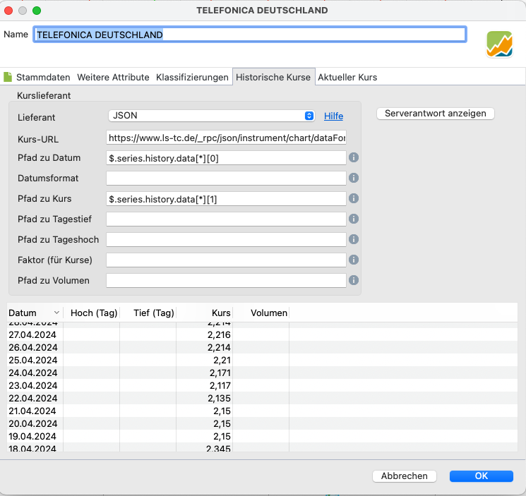
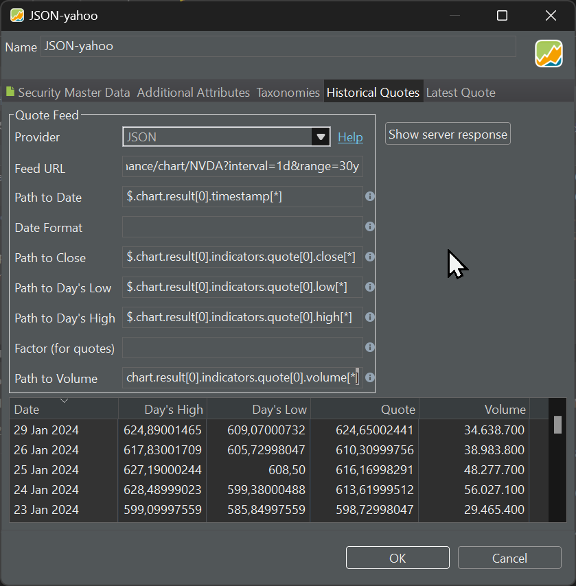

## Datenimport via API

Finanzwebseiten stellen ihre Daten, z. B. historische Kurse, in der Regel über eine Schnittstelle (API) zur Verfügung. Um auf diese historischen Kurse über die API zuzugreifen, können Benutzer HTTP-Anfragen an bestimmte API-Endpunkte senden und dabei Parameter wie Datumsbereiche, Aktiensymbole und andere relevante Filter angeben. Der API-Endpunkt (=Server) verarbeitet diese Anfragen, ruft die angeforderten historischen Kursdaten aus seiner Datenbank ab und gibt die Informationen in einem strukturierten Format, häufig JSON oder XML, zurück.

Als Beispiel dient die folgende [URL](https://eodhd.com/api/eod/AAPL?from=2024-01-15&to=2024-01-17&period=d&api_token=demo&fmt=json), um die historischen Kurse von Apple zwischen 2024-01-15 und 2024-01-17 von der Website `eod historical data` abzufragen.

`https://eodhd.com/api/eod/AAPL?from=2024-01-15&to=2024-01-17&period=d&api_token=demo&fmt=json`

Mit Stand vom Januar 2024 ist der bereitgestellte Demo-API-Token noch gültig. Sollte er in Zukunft nicht mehr funktionieren, brauchst Du einen [kostenlosen API-Schlüssel](eodhd.md).

``` JSON
[
    {
        "date": "2024-01-16",
        "open": 182.16,
        "high": 184.26,
        "low": 180.93,
        "close": 183.63,
        "adjusted_close": 183.63,
        "volume": 65603000
    },
    {
        "date": "2024-01-17",
        "open": 181.27,
        "high": 182.93,
        "low": 180.3,
        "close": 182.68,
        "adjusted_close": 182.68,
        "volume": 47317400
    }
]

```

Eine JSON-Antwort kann zwei Arten von Elementen enthalten: Listen und Objekte. Eine Liste ist eine geordnete Sammlung von Elementen zwischen [ ]. Auf diese kann über ihre Position zugegriffen werden. Ein Objekt ist eine ungeordnete Sammlung von Schlüssel-Werte-Paaren zwischen { }. Ein Schlüssel ist ein eindeutiger Identifikator für einen Wert, und ein Wert kann eine beliebige Art von Daten sein, z. B. eine Zahl, eine Zeichenkette, ein Boolescher Wert, eine Liste oder ein Objekt. Eine JSON-Antwort ist eine hierarchische Struktur, d. h. eine Liste kann andere Listen oder Objekte enthalten, und ein Objekt kann andere Listen oder Objekte enthalten.

Um auf einen bestimmten Wert innerhalb dieser hierarchischen Struktur zuzugreifen, musst Du den Pfad von der Wurzel zum Element angeben. Um auf ein Element in einer Liste zuzugreifen, musst Du seinen Index verwenden, der eine Zahl ist, die seine Position in der Liste angibt. Der Index beginnt bei 0 für das erste Element. Um auf ein Element von einem Objekt aus zuzugreifen, musst Du seinen Schlüssel verwenden, der eine Zeichenkette ist, die seinen Namen im Objekt angibt. Der Schlüssel wird in doppelte Anführungszeichen "" eingeschlossen.

Eine Abfragesprache wie *JSONPath* (von Portfolio Performance verwendet) stellt die Wurzel der JSON-Antwort mit einem $-Symbol dar. Um die Elemente im Pfad zu trennen, musst Du einen Punkt verwenden. Um zum Beispiel auf den Schlusskurs des zweiten Tages zuzugreifen, musst Du den Pfad ``$[1].close`` verwenden. Das bedeutet, dass Du mit der Wurzel $ beginnst, dann zum zweiten Element in der Liste ``$[1]`` gehst, das ein Objekt ist, und dann zum Wert mit dem Schlüssel "close" im Objekt ``$[1].close`` gehst, das eine Zahl ist.

Du brauchst diesen JSON-Pfad, um den JSON Quote Feed Provider von Portfolio Performance zu vervollständigen. Verwende  die folgenden Parameter, um die historischen Kurse abzurufen (siehe auch Abbildung 1). Eine Erklärung der Bedeutung der verschiedenen Kursnotierungen findest Du unter Grundlagen > [Historische Kurse](../../grundlagen/historische-kurse.md).

Abbildung: Server Antwort mit Kursdaten im JSON-Format (=2D.DE).{class=pp-figure}



- Kurs-URL: `https://www.ls-tc.de/_rpc/json/instrument/chart/dataForInstrument?container=chart1&instrumentId=41717&marketId=1&quotetype=mid&series=intraday%2Chistory%2Cflags&type=&localeId=2`
- Pfad zu Datum: `$.series.history.data[*][0]`
- Pfad zu Kurs: `$.series.history.data[*][1]`


Versuchen wir es mit einem etwas komplizierteren Beispiel. 
Die folgende URL ermöglicht den Abruf der beiden jüngsten Tageskurse von NVIDIA aus Yahoo Finance (klicken Sie auf den folgenden Link, um das Ergebnis zu sehen).

[https://query1.finance.yahoo.com/v8/finance/chart/NVDA?interval=1d&range=5d](https://query1.finance.yahoo.com/v8/finance/chart/NVDA?interval=1d&range=2d)

Die Antwort von Yahoo-Server ist ein langes JSON-Dokument mit allen historischen Kursen der letzten 2 Tage. 
Die Ausgabe wurde aus Gründen der Übersichtlichkeit umstrukturiert und gekürzt (scrollen Sie nach unten, um die Kurse zu sehen).

``` JSON
{
  "chart": {
    "result": [
      {
        "meta": {
          "currency": "USD", 
          "symbol": "NVDA"
        },
        "timestamp": [1705415400, 1705501800],
        "indicators": {
          "quote": [
            {
              "close": [563.82, 560.53],
              "open": [550.17, 563.46],
              "high": [568.34, 564.71],
              "low": [549, 547.40],
              "volume": [44958000, 47439400]
            }
          ],
          "adjclose": [
            {
              "adjclose": [563.82, 560.53]
            }
          ]
        }
      }
    ],
    "error": null
  }
}

```

Die JSON-Antwort von oben ist ein Objekt, das von { } umgeben ist. 
Es enthält Metadaten des Wertpapiers, Unix-Zeitstempel der beiden abgerufenen Daten und die verschiedenen Kurswerte. Du brauchst einen JSON-Pfad, um die verschiedenen Werte abzurufen:

- Fehler Code: `$.chart.error`
- Metainformation der Aktie: `$.chart.result[0].meta`.  Das Ergebnis kommt in einem Array, selbst wenn es sich nur um eine Aktie handelt, denn man hätte auch 2 und mehr Aktien abfragen können.
- Symbol (): `$.chart.result[0].meta.symbol`
- Abgefragtes Datum: `$.chart.result[0].timestamp[*]`. Das * dient als Platzhalter, um alle Variablen lesen zu können
- Zweites Datum: `$.chart.result[0].timestamp[1]`
- Alle verfügbaren Kurse (inkl. bereinigter Kurse): `$.chart.result[0].indicators`
- Alle nicht bereinigten Kurses: `$.chart.result[0].indicators.quote[0]`
- Schlusskurse: `$.chart.result[0].indicators.quote[0].close`
- Schlusskurs vom ersten Tag: `$.chart.result[0].indicators.quote[0].close[0]`

Wenn Du das üben möchtest, nutzt Du am besten [JSONPath Online Evaluator](https://jsonpath.com/). Kopiere die JSON-Antwort in die Eingabemaske. Ein weiteres praktisches Tool [JSONPath Finder](https://jsonpathfinder.com/).

Mit den oben genannten Informationen sollte es ein Leichtes sein, Kurse mit JSON abzurufen.

Abbildung: JSON Kursdaten Parameter.{class=pp-figure}



Bei den meisten Diensten muss man sich registrieren, um einen API-Schlüssel zu erhalten, eine eindeutige Kennung, die den Nutzer authentifiziert und den Zugang zum Dienst ermöglicht. Zwar bieten zahlreiche Finanzdienste scheinbar kostenlose API-Schlüssel an, doch erweisen sich ihre Nutzungsbedingungen und langfristigen Verpflichtungen oft als unzureichend. Portfolio Performance hat aus Kompatibilitätsgründen mehrere dieser Dienste in seiner Liste der Kursquellen-Anbieter behalten; z.B. Alpha Vantage, eodhd, .... In der Regel empfiehlt es sich, Portfolio Report und Yahoo Finance für ein typisches Portfolio zu nutzen.

### Beispiel Onvista API
https://www.onvista.de/ hat ein breites Spektrum an Assets und dazu auch sehr lang vorgehaltene historische Daten. Wer historische Daten von vor 10 Jahren und mehr benötigt (bspw. für das Tracken von Rentenversicherunge etc.). Auf der Seite eines Assets kann man aktuell unter "Alle Kurse" ganz unten unter "Historische Kurse zu XYZ". 
