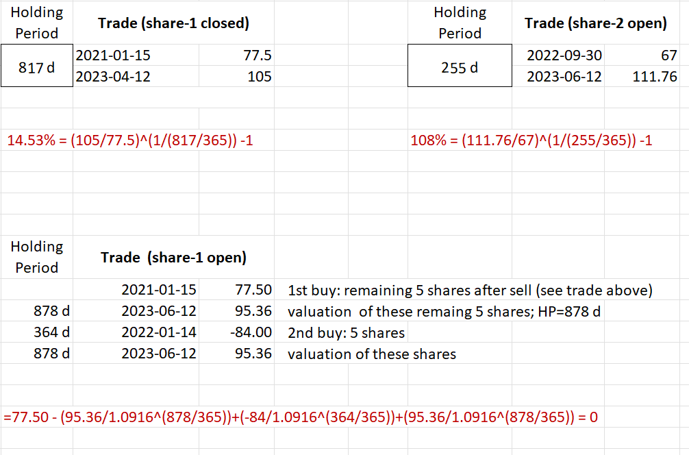
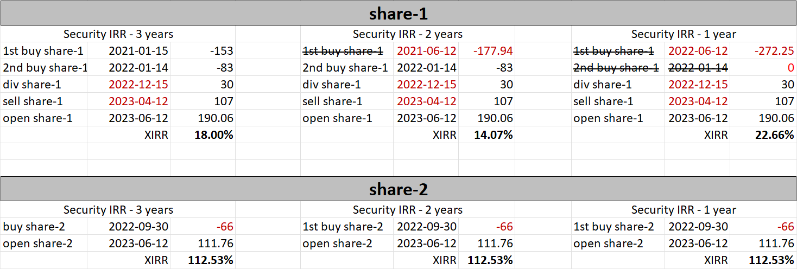

Let's build a simple example -step by step- to illustrate some pitfalls of the IRR concept. Create a new portfolio `test-01.xml` with currency EUR. Add a securities account `broker-A` and a reference account `broker-A (EUR)`. Add two new empty instruments (`share-1` & `share-2`). Use the symbol tickers `DTE.DE` and `TMV.DE` respectively and set Yahoo Finance (`Exchange Deutsche Börse XETRA`) as quote Feed.

Add the following transactions: make a deposit of 155 EUR, buy 10 shares of share-1 at 15 EUR on 2021-01-15, ... (see figure 1).

{ pp-figure } 

{ pp-figure }

{ pp-figure }

**Some caveats**

  + If you don't include the deposits (to buy the securities), the performance IRR would become -infinity for longer reporting periods. Deposits accounts are *always* included in IRR calculation. If you don't deposit before buying shares, this account will be most of the time negative (you have bought some shares but there was no deposit) until there are dividends or sell transactions.

  + If you don't provide historical quotes, Performance and Securities IRR (1 and 2 years) will differ from the example. In absence of the historical quotes, PP will take the transaction value to calculate the initial value at reporting start; see manual on [reporting periods](reporting-period.md).

# Trade IRR

The **Trade IRR** is calculated under `Sidebar > Reports > Performance > Trades`. There are three trades in the example of figure 1. A *closed* trade starting with a buy on `2021-01-15` and ending with a partial sell on `2022-01-14`. The remaining shares make the second *open* trade, starting at `2022-01-14` and ending at the current date (e.g. `2023-06-12`). The third trade is also open because share-2 hasn't been sold yet.

Note that PP use a `FIFO principle` (first-in; first-out) to determine which shares will be sold. The 5 shares that are sold on 2023-04-12 are the one that were bought in 2021-01-15; *not* the one that were bought on 2022-01-14.

It's very important to have the cashflow amounts and dates correct. In the first trade (share-1 closed), 5 shares of the first buy are sold. The net transaction value of this first buy was 155 EUR. The initial outflow of trade 1 is 5 * 155/10 or 77.5 EUR. These were sold on `2023-04-12` for 105 EUR. The holding period of these 5 shares was `2023-04-12` - `2023-06-12` = 817 days. The IRR is according to [equation (2)](irr-theory.md) = (105/77.50)^(1/(817/365) or 14.53%.  You can of course also use the Excel-function XIRR().

Trade (share-1 open) is a special case. First of all this trade ends on the current day (e.g. `2023-06-12`). But it consists of shares that were bought in 2021 and in 2022. Five shares are from 2021. The cash outflow is thus -77.5 EUR. Today, they are valuated at 95.36 EUR. The remaining 5 are from 2022-01-04 with a cash outflow of -84 EUR. These 5 shares are also 95.36 EUR worth today (`2023-06-12`). Equation 2 cannot help us here because there are multiple terms. Inserting IRR = 9.16% in eq (1) will result in exactly the initial cash outflow of -77.5 EUR (or you could use the Excel function; see figure 5).

# Security IRR

Both Security IRR and Performance IRR work with a [reporting period](reporting-period.md). This complicates the calculation quite a bit.

**Important**

  + All values are WITHOUT taxes. Fees are included. The Net Transaction value is not used for the Security IRR calculation (it is for the other types).

  + Depending on the selected period, the  reporting date of 1st buy and 2nd buy is either at the transaction date or at the starting date of the reporting period.

  + Contrary to the Performance IRR, dividends and sell results leave the portfolio at transaction date. Deposit accounts (where these results are stored) are not included in the Security IRR.

## 3 years reporting period

Today is `2023-06-12`. The start date of the period is thus `2020-06-12`. Because all shares are bought after this date, you need to work with the transaction dates and values (excluding taxes!).

With an IRR = 18.00%, applying [Eq (1)](irr-theory.md) with share-1 will result in:

=153 - (-83/(1.18)^(364/365))+(30/(1.18)^(699/365))+(107/(1.18)^(817/365))+(190.06/(1.18)^(878/365)) = 0

Calculating IRR for share-2 is much easier because there are only two terms; see [equation (2)](irr-theory.md).

IRR = (111.76/66)^(1/(255/365))-1

## 2 years reporting period

The start of the reporting period is on `2021-06-12`. The first buy of share-1 is already done. For this cashflow, you need to take the transaction date as the reporting date. The other dates and values remain the same as in the 3 years report.

For share-2 nothing changes because the transaction date is later than the reporting start.

## 1 year reporting period

Both 1st and 2nd buy fall before the reporting date. Both transactions are valuated at the reporting start for 272.25 EUR. You can delete the line of 2nd buy or set the value to zero (0/xxx = 0).

Share-2: same dates and values as in reporting periods 3 years and 2 years.

# Performance IRR

**Important**

  + The performance IRR computes the IRR for the whole portfolio, including deposit accounts.

  + a deposit for each buy is necessary, otherwise a -infinity IRR (because of the very large negative deposit accounts)

  + dividends and sell transactions are placed on a deposit account and keep contributing to the IRR.

  + PP calculates a "Pooled IRR". This has some disadvantages.

## 3 years reporting period

  + The values are self-explaining: the net transaction value of the 1st buy of share-1 was 155 EUR. On the ending date of the period the remaining share-1 are valuated at 190.06 EUR (10 x 19.006 EUR ).

  + The dividend and sell transaction have a different date than the transaction date. That's because the result of the transaction is put on a deposit account and stays there until the period end.

## 2 years reporting period

  + The initial value of the 2 years reporting period is 177.94 EUR. The 1st buy of share-1 has taken place before the starting date of the period (2021-06-12). This date, however is a Saturday. So, the last valid historical quote on Friday, 2021-06-11 (17.794 EUR) is taken to valuate the stock and the period start has moved 1 day earlier.

## 1 year reporting period

  + The start date of the period should be `2022-06-12`; so 1st and 2nd buy of share-1 are already done and should be valuated on that day. This date, however, is a Sunday, so, the historical quote of Friday, `2022-06-10` is taken (18.15 EUR), making the initial value 15 * 18.15 = 272.25 EUR. This includes the second buy. The value of this transaction is set to 0. The starting date of the period should be set to `2022-06-10`.

  + There is a small difference between the calculated IRR from PP (27.75%) and the outlined procedure above (27.45%). 

