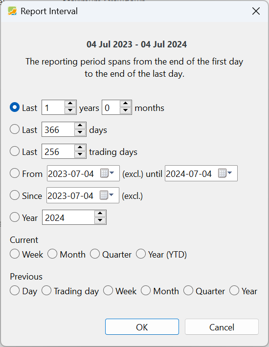

The (reporting) period is the time slice that is taken into account for reporting (calculations, graphs, statistics). It's very important that you realize that for every performance calculation a reporting period is taken into account, even if you haven't set one explicitly. By default, it is set to one year from the current day.

You can set set the reporting period with the drop-down icon in the top-right corner of the window (see fig 1). The available options are: 1 year, 2 years, 3 years, New ..., Manage ... With this last option you can delete or reorder the available time periods.

The 1, 2, 3 years period is always calculated from the current day. If the current day is 2023, May 15, then ...

| Period  | From end of … to end of …   | 
| ---     | ----                        |
| 1 year  | 2022, May 15 - 2023, May 15 | 
| 2 years | 2021, May 15 - 2023, May 15 | 
| 3 years | 2020, May 15 - 2023, May 15 |

With New, you can create custom time periods. The options in the figure below are self-explanatory. You cannot give a self-chosen name to this period.
