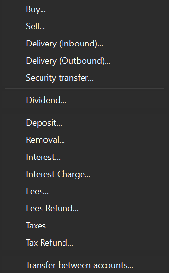
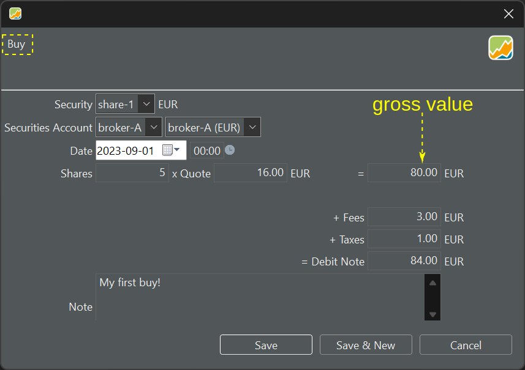
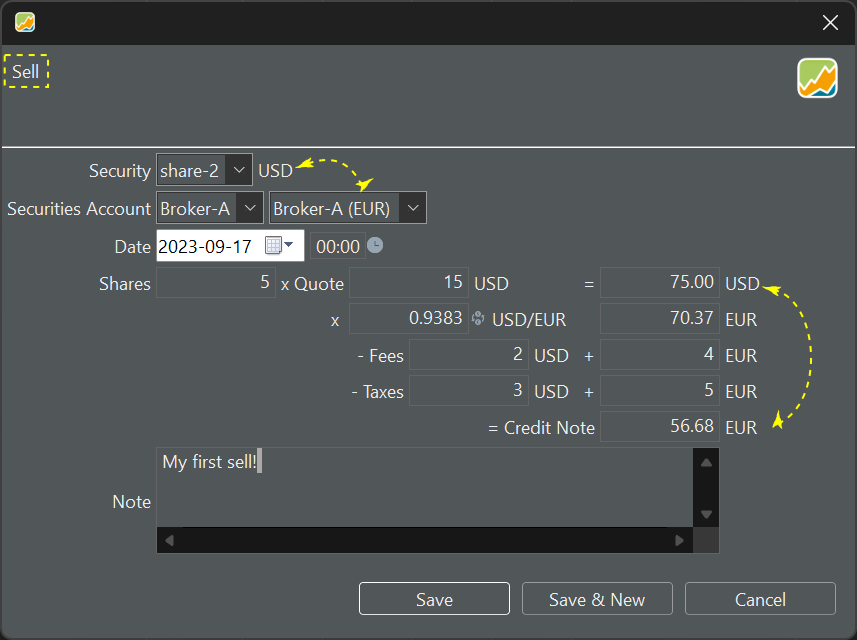
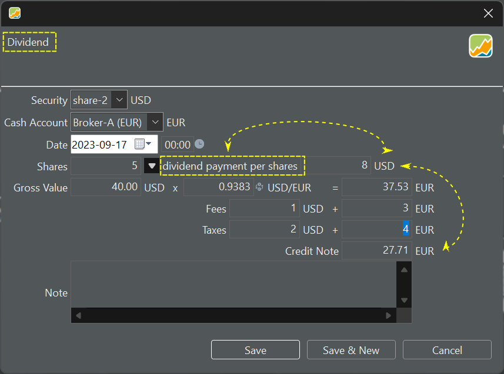

{ #align-right }

A financial transaction is an agreement between a buyer and seller to exchange goods, services, or assets for payment. In case of PP, the exchange is about securities. Transactions are the core of PP. You can divide them broadly into security and deposit transactions (see figure 1).

- Security transactions: buy, sell delivery (inbound), and delivery (outbound).
- Deposit transactions: deposit, removal, interest, interest charge, fees, fees refund, taxes, tax refund.
- A dividend is a special deposit transaction. The cash is coming from the dividend payment of the security.

Security transfer ... and Transfer between accounts ... aren't real transactions but manual operations between accounts.

# Buy transaction
Figure 2 shows the input panel to enter a buy transaction. The security (share-1) is quoted in EUR and the transaction is handled through an EUR deposit account. In figure 4 (sell transaction) a more complex situation is depicted. The security is quoted in USD, but the transaction runs through a deposit account in EUR.

{.pp-figure}

- **Security** : you can choose the security from a drop-down. If a particular security was already selected before the start of the transaction, this info is filled in. Please note that the currency is automatically set because each security has a reference currency. This is set while [creating the security](../getting-started/adding-securities.md).
- **Securities Account** : choose with drop-down or already filled in, if you started from a Securities account.
- **Deposit Account** : choose with drop-down or already filled in with the [account](account.md) of the security. If the currency of the chosen deposit account is different from the security currency, then the Gross Amount and Fees and Taxes have to be converted. So, you also need an Exchange Rate. See Figure 3 for an example.
- **Date of transaction** : you can choose this date from a calendar or enter it manually (format = YYYY-MM-DD). With the field to the right (00:00), you can enter the time of the transaction. A 12 or 24 hours clock is set with the menu `Help > Preferences > Language > Country`.
- **Shares**: the number of securities that you buy or sell. This can be a decimal number.
- **Quote** : this is the price that you paid for one share. If the security contains historical prices (see [adding securities](../getting-started/adding-securities.md)), the correct price for the given date is already filled in.

The above six fields are mandatory in order to complete the transaction. Most of these fields are already filled, based on the selected security. The following fields are calculated or optional.

- **Gross Value** : this is the product of shares * Quote. If you change afterwards the gross value, then the quote price is changed, so that the equation shares * quote is again correct.

- **Fees** and **Taxes** : a buying transaction typically involves fees and taxes. The can be in the currency of the security and/or deposit account (see figure 4 for an example).

- **Debit Note** : this is the amount that you have to pay as a result of this buying transaction. It is calculated from shares * quote + fees + taxes. Other names are: Value or Net Value.

- **Note** : you can add a textual note to each transaction.

The normal flow to enter this information is probably: shares * quote (price) >> gross value + fees + taxes >> debit note. There are a few peculiarities if you change something afterwards (see figure 3)

{.pp-figure}

-  Changing the debit note (afterwards) will change the Gross value and as a result of that also the quote price. The number of shares is untouched.
- Changing the Gross Value afterwards, will change the Debit note and the Quote Price. Fees and taxes and the number of shares are untouched.

# Sell transaction

The Sell transaction more complicated because we use a USD security that is cashed in an EUR deposit account. Three new fields appear upon selecting the EUR account: exchange rate (XR), USD fees and USD taxes.

{.pp-figure}

The share is quoted in USD and therefore the first Gross Value is also calculated in USD.  Because, you want to cash this transaction in an EUR account, this USD value must be converted. From the moment, you select a deposit account with a different currency, the exchange rate field (e.g. 0.9383) is populated with the correct rate for that date and currency. The website of the European Central Bank (ECB) is consulted for this. See the menu `View > Currencies > Currency Converter`.

Changing the date afterwards will change the XR appropriately, even if you have entered manually an XR. So, setting the transaction date first is good practice.

You can enter fees and taxes in both currencies. The foreign fees and taxes will of course be converted using the same XR. There is no subtotal of this in local currency. So, the Credit Note is not a simple addition of the numbers above.

The calculation flow remains the same as in figure 3. For example, changing the Credit Note will change the Gross Value in EUR, that in turn will change the Gross Value in USD (XR remains untouched), and finally the Quote price.

# Dividend transaction
Booking a dividend is almost like a buy or sale; except that the quote price is replaced with a field Dividend payment per shares (see figure 5)

{.pp-figure}

There is no separate function to book a "Dividend Investment Plan" (DRIP). One solution is to fully book all dividends with a buy transaction of the agreed-upon number of shares. More information at [Reinvesting dividends](../procedures/reinvesting-dividends.md).
