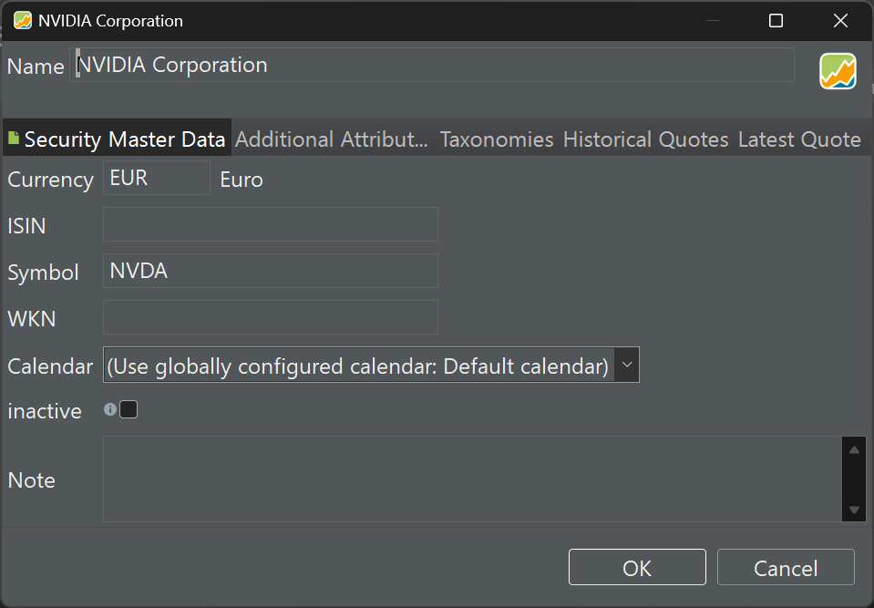
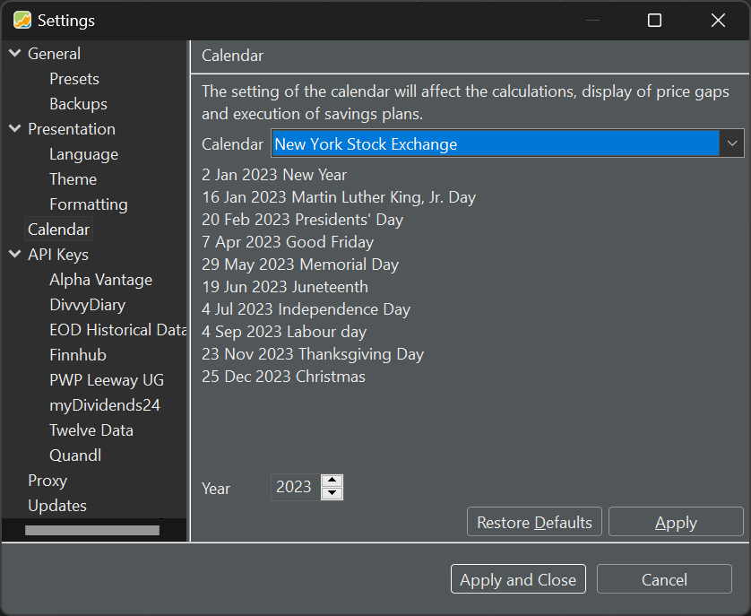
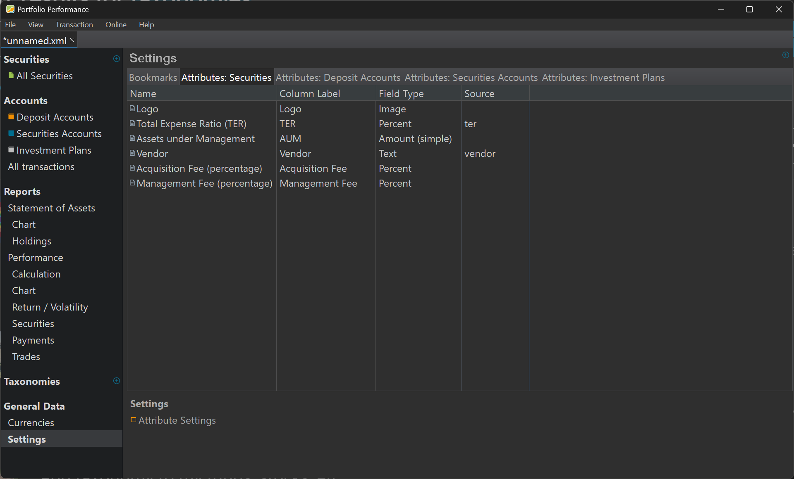
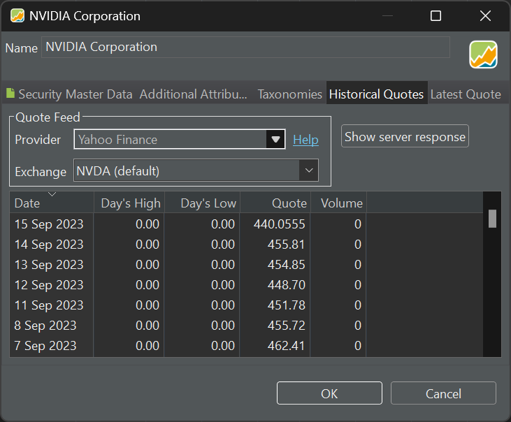
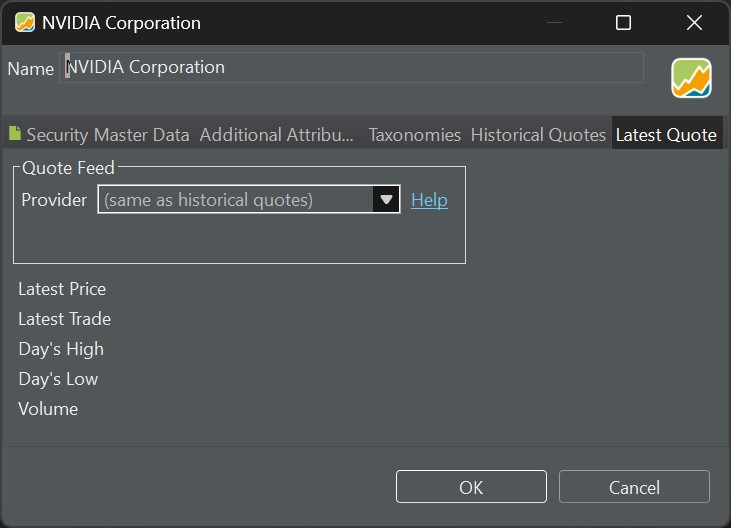

Immediately after the previous "Create portfolio" step, the application's main screen looks a bit empty (see Figure 1). The left sidebar option 'Securities > All Securities' can be used to generate a list of securities.

!!! note
    A security is a financial instrument that holds value and can be traded between parties. Securities can be broadly categorized into: debt securities (e.g., banknotes, bonds, and debentures) equity securities (e.g., common stocks) derivatives (e.g., forwards, futures, options, and swaps) [[1]]('https://en.wikipedia.org/wiki/Security_(finance)').

The list contains all the securities you are interested in; not necessarily the ones you have bought. At the moment, it's still empty.

{.pp-figure}

 The `Add new investment instrument` button allows you to start adding securities to your portfolio. As you can see in Figure 1, you can add new instruments (stocks, bonds, ...), cryptocurrencies, exchange rates. You can also import securities from a CSV-file or to create a new empty security.

 More options are available from the `File > New` menu (see Figure 1).

 # Adding new instruments

 Selecting the New > Security (menu) or New instrument ... (button) opens the following window (see Figure 2).

 {.pp-figure}

 You can type (part of) the security name in the search box. You can search for shares or bonds or both. After clicking the Search button, the list below will be populated with possible target instruments.

 The following fields are displayed for each instrument:

 + Name: the full name of the security according to the data source (see below) from which it is retrieved, e.g. Yahoo Finance.
 + Symbol: the abbreviation (ticker) used by the data source.
 + ISIN: International Securities Identification Number: a unique twelve-digit code that is assigned to every security in the world. Mostly used by European brokers & banks.
 + WKN: Wertpapierkennnummer: a German six-digit alphanumeric code for the identification of a security, now replaced by the ISIN code.
 + Type: can be Share, Bond, Cryptocurrency, Aktie, Währung, Futures, etf, fonds.
 + Exchange: a security may be traded on more than one exchange. For example, the NVIDIA stock is traded on Nasdaq (symbol NVDA, exchange NMS) or XETRA (symbol NVD.DE, exchange GER), and many other exchanges.  
 + Currency: not used?
 + Source: could be Yahoo Finance, CoinGecko, or Portfolio Report. [Yahoo Finance](https://finance.yahoo.com/) provides financial news and data including stock quotes, press releases, and financial reports. [CoinGecko](https://www.coingecko.com/) is a website with real-time information on most cryptocurrencies. [Portfolio Report](https://www.portfolio-report.net/search) is an open source project that aims to provide centralised portfolio performance data.

 Once you have selected the correct security, you need to click on the Apply button to proceed to the next step. Some information such as name, symbol and historical quotes will already be filled in, based on the selected data source. You can/should change all this info; even the name. In fact, it's even possible to start from an empty instrument and fill in this information yourself.

 {.pp-figure}

It's very important that you select the correct currency in which your security is traded. For NVIDIA on Nasdaq, this is USD, which may be different from the default currency of your portfolio.

The Calendar dropdown allows you to select a specific stock market calendar; e.g. Euronext, London Stock Exchange, New York Stock Exchange, ... These calendars contain info about trading days, (bank) holidays, ... for this specific exchange. These dates will affect some calculations, the display of price gaps and the execution of savings plans. You can view the different calendars available with their respective dates from the `Help > Preferences > Calendar` menu. See for example the specific dates for the New York Stock Exchange in Figure 4. 

{.pp-figure}

A security can be set to active or inactive. If it is set to inactive, then the security will not appear in buy or sell dialogs and the historical prices will not be updated automatically.

At the bottom of Figure 3 you can add a personal note for this security.

These fields are called the Security Master Data (see top of Figure 3). There are four other tabs: Additional Attributes, Taxonomies, Historical Quotes, and Latest Quote.

## Additional Attributes

This tab allows you to supply additional data, besides the info that is already included in the Security Master Panel.

Click on the `+ button` to add a new attribute such as Logo, Total Expense Ratio, Assets under Management, Vendor, Acquisition Fee (percentage), and Management Fee (percentage). These additional attributes can be added to tables such as `Reports > Performance > Securities`. These fields are not calculatedand cannot be used in calculations.

Additional attributes are defined in `(left) Sidebar > General Data > Settings > Attributes : Securities` (at the bottom).

{.pp-figure}

## Taxonomies

<figure style="float: right; width: 40%">
  
  <figcaption>Figure 6: Managing taxonomies.</figcaption>
</figure>

A taxonomy is a classification of your securities. For example, the `Type of Security` taxonomy (see presets in Figure 6) can classify your securities into: stock, Equity Fund, Exchange Traded Fund (ETF), Bond, Stock Option, Index, or Currency. Setting the correct type should be done in the Taxonomies panel when adding or editing the security (see Figure 3).

Other useful presets are Industries, following the Global Industry Classification Standard (GICS), regions (up to country level), and assets (cash, equity, debt, ...).

You can select these taxonomies in the `Left sidebar > Taxonomies` (see figure 6). Click on the `+ button` to see all presets or to create your own custom taxonomy.

## Historical Quotes

For evaluating your portfolio, you need the current & historical prices of the security. In this panel (see Figure 7) you can set the data source of the Quote Feed. As provider, you can choose between several alternatives: Yahoo Finance, Alpha Vantage, Quandl, .... You can even refer to a webpage (e.g. from an investor site) that contains these historical data; see for example [Morningstar](../tricks/morningstar.md). Or you can create them yourself and import the quotes with a csv-file.

{.pp-figure}

## Latest Quote.

The latest (most recent) quote can be retrieved from the same data source as the (older) historical prices. However, this data source may be returning only daily quotes. If you want more recent prices from another source, you can use this panel (see Figure 8).

{.pp-figure}

