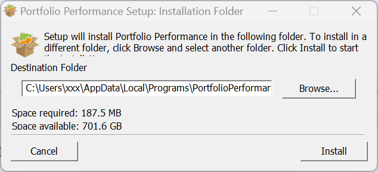
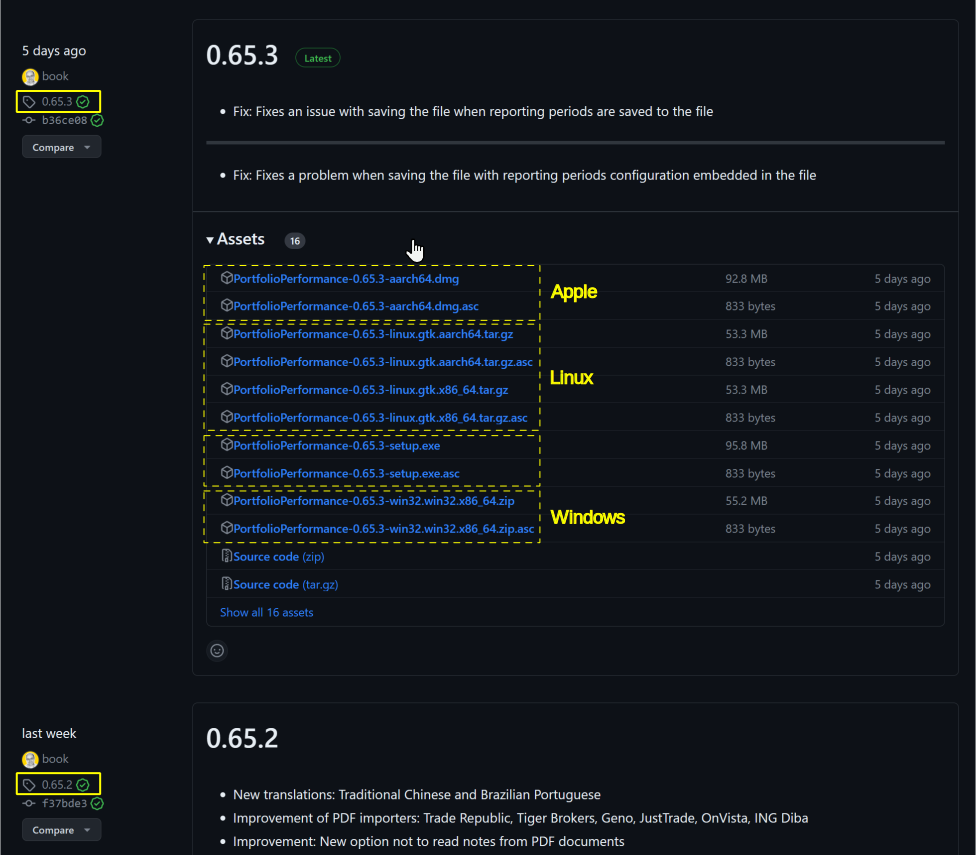

PP is available for MacOS, Windows and Linux. You need to download it and do some installation steps. The easiest way to download and install the latest version of PP is by using one of the installer files at the [homepage](https://www.portfolio-performance.info/) (see fig 1). A link to the release notes of this latest version is also provided. 

 { .pp-figure}

# Windows
You can download the compressed *Zip-file* and extract it in a directory at your choice. Even a portable USB-stick (about 250 MB free space) is fine (run from stick).

You can also download the Windows - Installer (setup.exe). On Windows 11, you get a security warning about the dangers of running an exe-file. After that, double clicking on this file, will start the installation. You can change the destination folder. By default, the c:\user directory is taken. You need about 200 MB of free space (see figure 2).

 { .pp-figure}

   + Windows: you can download the compressed Zip-file and extract it in a directory at your choice. Even an USB-stick (about 250 MB free space) is fine (run from stick). You can also download the installer file (setup.exe). On Windows 11, you get a security warning about the dangers to run a exe-file. Double clicking on this file, will start the installation. You need about 200 MB of free space.

# MacOS

# Github   
The installer files are in fact stored in the [author's github repository](https://github.com/portfolio-performance/portfolio/releases). So, you can also download the program from this repository. If you ever should need a previous version, this is also the place to be (click on the version number at the left side).

You can edit and compile the source code; see [Contributing to Portfolio Performance](https://github.com/portfolio-performance/portfolio/blob/master/CONTRIBUTING.md#project-setup).

# Updating the software
After the first installation, the program will check on each start-up for new updates and install these automatically (see figure 1).

