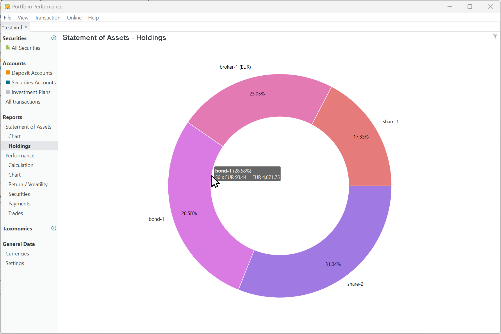

A visual representation of the total value of the portfolio divided into categories such as different accounts is given by the Holdings chart (menu View > Statement of Assets > Holdings or with the sidebar). A doughnut chart displays the proportion of different accounts within the total, with the entire doughnut representing 100%.

Figure: Doughnut chart of the total value of portfolio.{class=pp-figure}

Hovering the mouse pointer over a segment of the doughnut chart reveals the following account details: name, percentage, number of shares, current share price, total value in the portfolio currency. In the case of a deposit account, the number of shares is fixed at one (see Figure 1).

Positions with negative values, such as a deposit account with a negative balance, are not displayed. By not displaying positions with negative values, the chart's percentages may be inaccurate. An error message alerts users to this situation.

With the filter icon (top right), you can show the entire portfolio or only a few combinations of accounts; for example `broker-1` with or without its associated deposit account `broker-1 (EUR)`. You can create a new filter, rename or remove existing ones.

For a portfolio with a large number of securities, the chart can become unreadable, and it's advisable to implement a filter.

