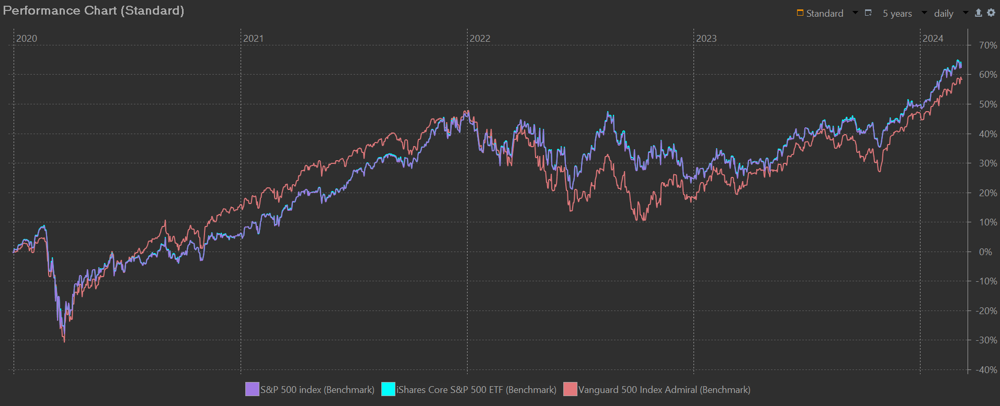
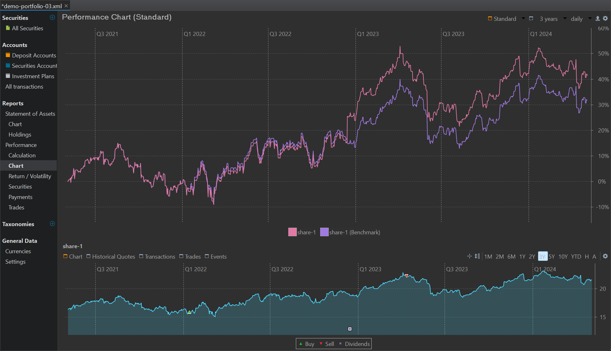

Benchmarking your portfolio performance against financial indexes is a common practice in investment management. This process involves comparing the returns of your portfolio or individual securities to the returns of a selected benchmark index.

A stock index is a measure of the value of a hypothetical portfolio of investment holdings that represents a segment of the financial market. For example, [Standard & Poor’s
500](https://www.spglobal.com/spdji/en/indices/equity/sp-500/#overview) index measures the performance of 500 large companies listed on stock exchanges in the United States. It is a market capitalization-weighted index, which means that the influence of each company in the index is proportional to its market capitalization. On March 8, 2024, the S&P 500 Index stood at 5,123.69 USD.

## Finding an index

A list of major indexes can be found on several financial websites such as [investing.com](https://www.investing.com/indices/major-indices) and [Yahoo Finance](https://finance.yahoo.com/world-indices/). In order to use an index for benchmarking your portfolio, you need to add it as a security.

For the indexes listed on Yahoo Finance, simply [add a new security](../getting-started/adding-securities.md) and search for the ticker symbol; e.g. ^GSPC. If you want to use the data from investing.com, you have to download the historical prices. Select the correct time period and click the download button to receive a CSV-file (you need a free registration for that). Create a new empty instrument. See the section [File > Import](../reference/file/import/csv-import.md#csv-files-comma-separated-values) and [How-to > Downloading Historical Prices](./downloading-historical-prices/csv-file.md#investingcom) for a detailed explanation how to import these historical prices. For appending the future daily prices, you can use the daily updated table from the last month. Set the Quote Feed of the Historical Quotes to `Table on website` and use the following Feed URL: https://www.investing.com/indices/us-spx-500-historical-data. This Quote Feed will not overwrite the existing prices but will append new ones.

There are plenty of mutual funds or ETF's that replicate an index. For example, both [Vanguard 500 Index Fund Admiral](https://investor.vanguard.com/investment-products/mutual-funds/profile/vfiax#portfolio-composition) and the [iShares Core S&P 500 ETF](https://www.ishares.com/us/products/239726/ishares-core-sp-500-etf) replicate the S&P 500 quite narrowly. So, you could use also one these funds as benchmark.

Figure: Benchmark of SP 500 index with two replicating funds. {class=pp-figure}

As depicted in Figure 1, the iShares Core S&P 500 ETF closely mirrors the S&P index. The Vanguard index fund also follows the trend closely but exhibits some deviations.

## Displaying the benchmark

To display a graph similar to Figure 1, follow these steps:

1. Navigate to the menu `View > Reports > Performance > Chart`.
2. Utilize the `Configure Chart` icon, represented by a gear symbol, located in the top right corner of the screen.
3. Within the configuration options, you can add or remove `time series` and `benchmarks`.
4. It's important to note that securities must have a market value, meaning they have been purchased, in order to be used as a time series. Benchmarks only require historical prices. Since we cannot buy stock of an index, we need to use the benchmark option for it.

Please take note that the historical prices for the displayed securities differ notably: roughly 5000 USD for the S&P index, and approximately 500 USD for both the iShares ETF and Vanguard index fund. Despite this discrepancy, the curves overlap, indicating that the vertical value axis of the graph represents the performance (not USD). The chart is indeed a performance chart.

## Comparing to the benchmark

Naturally, you'd want to compare the performance of your portfolio or that of an individual security against one of the benchmarks. You may also wish to evaluate your track record of buying and selling by comparing it with the unbiased historical prices of a specific security.

Figure 2 compares the performance of `Share-1 (Benchmark)` with the `actual Share-1` in the portfolio in the main pane. See above for adding both indices to the performance chart. The information pane contains the chart of `share-1` with the buy, dividend, and sell transaction indicated. The reporting period spans 3 years for both panes, commencing from May 5, 2021. 

Figure: Benchmark of SP 500 index with two replicating funds. {class=pp-figure}

The historical price of share-1 was 16.412 EUR/share on 2021-05-05. Therefore, the Market Value Begin (MVB) for the `actual share-1` is 164.12 EUR (10 shares) and for the benchmark, it is 16.412 EUR (1 share). You can always export the performance chart as [CSV-file](../concepts/performance/time-weighted.md#exporting-data-from-pp) to obtain precise numerical data.

After some initial fluctuation, the quote price dropped to 16.026 EUR/share on 2022-01-13 (the day before the second purchase). Using [Equation 1](../concepts/performance/time-weighted.md) of the section on Time-Weighted Rate of Return, this results in a performance of - 2.35% for both indices.

From that point onwards, the two indices begin to diverge. The benchmark solely utilizes historical prices, while the performance of the `actual Share-1` takes into account both inbound and outbound transfers. For instance, on January 14, 2022 (date of purchase), the quoted price was 15.962 EUR/share. Consequently, the daily performance of the benchmark was calculated as 15.962/16.026 = -0.40%, leading to a cumulative performance of -2.74%. Meanwhile, the daily performance of the `actual Share-1` was calculated as follows: MVB = 10 x 16.026 = 160.26 EUR; MVE = 15 x 15.962 = 239.43 EUR. The purchase value of 5 additional shares was 83 EUR (inclusive of 3 EUR in fees). According to [Equation 1](../concepts/performance/time-weighted.md) of Time-Weighted Rate of Return, the daily performance of the actual share-1 is -1.57% (versus -0.40% for the benchmark), giving a cumulative performance of -3.89%.

The most significant divergence occurs when a dividend is paid on December 15, 2022. The performance of the actual Share-1 benefits from this additional outbound transfer, resulting in a significant increase in the daily performance of around 9%.

As previously mentioned, the numerical values for both indices can be obtained from the CSV file. However, the Securities table under [View > Report > Securities](../reference/view/reports/performance/securities.md) does not include information on `share-1 (Benchmark)` due to the absence of associated transactions. Nevertheless, it is feasible to present the benchmark's performance graph and the TTWROR value as a widget.

Figure: Dashboard with performance chart and TTWROR widgets. {class=pp-figure}

