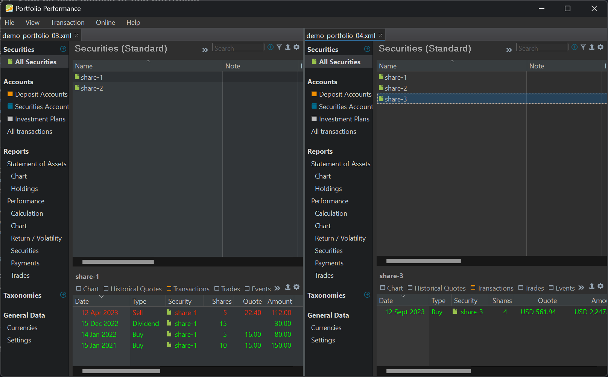

To copy a security between portfolios, you must arrange the two portfolios side by side. (see Figure 1).

Figure: Side-by-side display of two portfolios.{class=pp-figure}

After opening two or more portfolios, they are displayed in the portfolio bar located just below the menu bar. The active portfolio, typically the last one opened, is easily discernible. To switch between portfolios, you can select the corresponding tab in the portfolio bar.

However, for tasks like copying securities between portfolios, it's necessary to have both portfolios visible side by side. Securities cannot be directly dragged and dropped or copied and pasted between portfolios in the portfolio bar.

To **arrange** portfolios side by side, choose one in the portfolio bar, click and hold the mouse to drag it to a new position. With two portfolios, you can position them either horizontally (left to right) or vertically (top to bottom). In Figure 1, the arrangement is left to right. This process can be repeated with multiple portfolios, allowing you to make more than two portfolios visible at the same time.

For **copying** securities between portfolios, both portfolios need to be visible. Then, you can select a security from Portfolio A and drag it to the `All Securities` option in the side panel of portfolio B. There, you can drop the security to create a copy. Pay attention, as it's feasible to unintentionally create identical securities (e.g. two instances of `share-1`).

It's important to note that dropping the security within the main top panel is not possible. 
