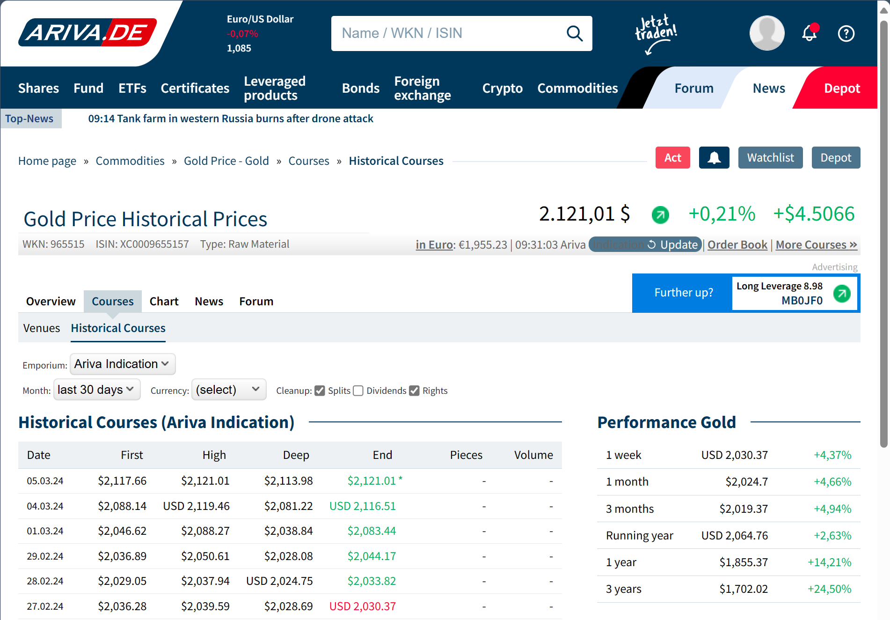
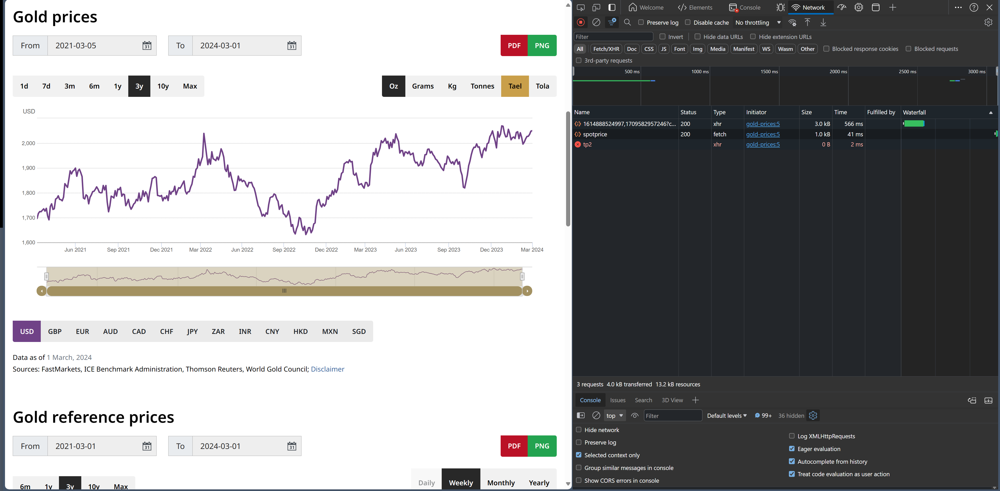
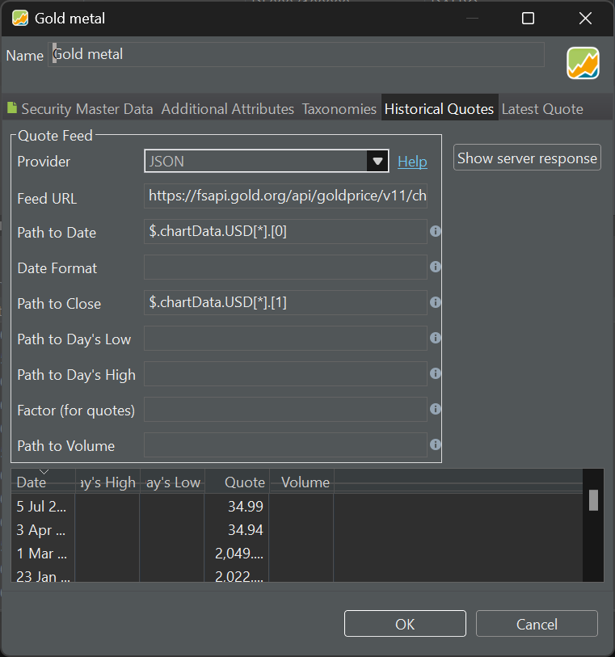

Investing in gold is often chosen in times of economic uncertainty. There are multiple ways to gain exposure to gold. One popular method is investing in physical gold, which involves purchasing gold bullion, coins, or jewelry. Another approach is investing in gold exchange-traded funds (ETFs) or gold trackers, such as [Invesco Physical Gold](https://www.invesco.com/uk/en/financial-products/etfs/invesco-physical-gold-etc.html). These financial instruments aim to replicate the performance of the gold price by holding physical gold in a secure vault. A third but indirect method of investing in gold is by purchasing shares of gold mining companies. Gold miners engage in the exploration, extraction, and production of gold, and their stock prices can be influenced by the price of gold.

Investing in gold through ETFs and gold mining company shares can be handled similarly to regular stocks like Apple Inc., offering ease of access, liquidity, and potential income. While physical gold differs from traditional stocks in several aspects (e.g. gold does not provide ownership in a company or entitle the holder to dividends), it can still be considered an investment that can be bought, sold, and managed as part of a well-diversified portfolio. And therefore, it can be handled in PP as a regular security.

The PP forum has a thread [Wo kann ich aktuelle und historische Gold- und Silberkurse laden?](https://forum.portfolio-performance.info/t/wo-kann-ich-aktuelle-und-historische-gold-und-silberkurse-laden/14/49). This section provides a summary and expands upon the information discussed in the thread.

## Ariva.de

The `ariva.de` website has a specific page for [commodities](https://www.ariva.de/rohstoffe/) such as gold, silver, and others. Downloading the latest gold price is as easy as setting the [Quote Feed to a webpage](./downloading-historical-prices/table-website.md) `https://www.ariva.de/goldpreis_gold-kurs/kurse/historische-kurse`. Unfortunately, this method only provides data for the last 30 days. As time progresses, the data will be updated for future days with this method, gradually accumulating several months of gold price history.

Figure: Ariva.de website (translated) with historical gold prices . {class= pp-figure}



You can also replace the Quote Feed URL by one of the previous months (e.g. `https://www.ariva.de/goldpreis_gold-kurs/kurse/historische-kurse?go=1&boerse_id=172&month=2024-02-29`). When importing the data, PP will ask if you want to keep the existing historical prices. By choosing to keep the previous data, you can maintain a continuous record of gold prices for all the months you have downloaded.

Perhaps the better method is to use a [dynamic data URLs](https://help.portfolio-performance.info/de/kursdaten_laden/#dynamische-kursdaten-urls). Replace the `month=2024-02-29` in the URL from above in the macro version `month={DATE:yyyy-MM-32}`. This macro will iterate on all previous months (back to 2003); if there are no data already available. With an empty dataset this can take some time.

Another option to obtain historical gold prices is to register for a free account on a financial website that offers historical data downloads in CSV format. After registering, you can download the historical prices as a CSV file, which can then be [imported](../reference/file/import.md#csv-files-comma-separated-values) into Portfolio Performance (PP).


## London Bullion Market Association (LBMA)

The London Bullion Market is the world's largest and most significant market for trading gold and silver. User [ristretto](https://forum.portfolio-performance.info/t/wo-kann-ich-aktuelle-und-historische-gold-und-silberkurse-laden/14/49) wrote a very interesting post on how to retrieve data from the LBMA website. But pay attention, the quotes go back until 1968 and it will take PP a very long time to process all quotes.

Create a new empty security, set the currency to 


## gold.org

The website gold.org offers historical gold prices in different currencies and for various quantities (oz, grams, kg; 1 ounce = 31.1034768 gr). To access the numerical data, you'll need a workaround. First, open the [gold prices graph](https://www.gold.org/goldhub/data/gold-prices). The server sends a text file (JSON file) containing the data, which is then used to create the graph locally on your computer. This method is more efficient in terms of time and bandwidth.

To find the URL for the JSON download, follow these steps:

1. Open the developer tools window in your browser, usually by pressing the F12 key.
2. Change something in the graph, such as the period, to trigger a data update.
3. Look for a change in the network tab of the developer tools window.
4. Copy the URL that appears. It should look something like the one shown in Figure 1.

Figure: gold.org website with developer tools visible. {class= pp-figure}



The URL should look something like:

`https://fsapi.gold.org/api/goldprice/v11/chart/price/usd/oz/1693853240038,1709582076959?cache`

You may remove the `?cache` parameter. Keep in mind that the workaround may change if the website updates its structure or data retrieval method.

This URL will provide you with the JSON data of the gold prices between two dates, expressed as Unix timestamps (number of milliseconds since January 1st, 1970), e.g. 1693853240038,1709582076959. Luckily, PP can work with these dates. Upon entering this URL in your browser, you will see the result displayed below.

```
{
    "system": {
        "request_time": "2024-03-04 20:19:20",
        "APIserverHostname": "fsapi.gold.org",
        "protocol": "https",
        "uri": "https://fsapi.gold.org/api/goldprice/v11/chart/price/usd/oz/1693853240038,1709582076959",
        "route": "fsapi.gold.org",
        "cached": false,
        "q": false,
        "params": {},
        "user": null,
        "response_size": 3318,
        "time_start": "2024-03-04 20:19:21",
        "time_stop": "2024-03-04 20:19:21",
        "mem_start": 32540152,
        "time": "0.021 secs",
        "mem_stop": 57446376,
        "mem_used": "24322.48 KB",
        "size": "3.33 KB"
    },
    "chartData": {
        "USD": [
            [
                1693872000000,
                1926.1
            ],
            [
                1693958400000,
                1922.05
            ],
            [
                1694044800000,
                1918.35
            ],
            [
                1694131200000,
                1927.8
            ],
```

To extract the date and the price, you need the JSON-path (see Figure 2).

Figure: Quote Feed JSON Provider with Feed URL and Path to Date and Close. {class= pp-figure}




You can use this method to initially populate yhe historical prices between two dates. Of course, after that, you don't need to download that extended period anymore. Only the prices since your last update are needed.

For that you can use the [dynamic data URLs](https://help.portfolio-performance.info/de/kursdaten_laden/#dynamische-kursdaten-urls).

https://fsapi.gold.org/api/goldprice/v11/chart/price/usd/oz/1693853240038,1709582076959

