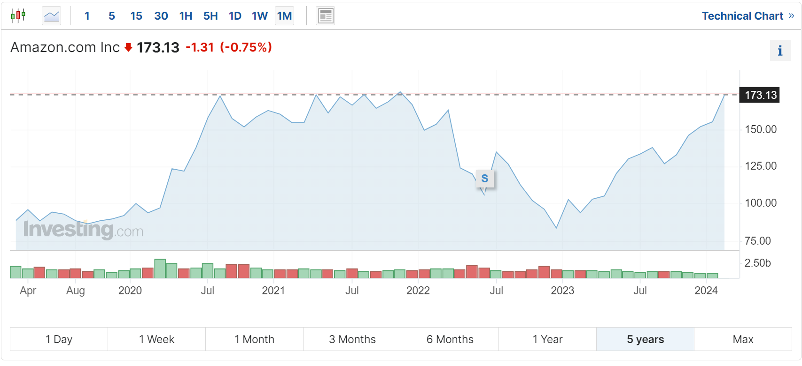
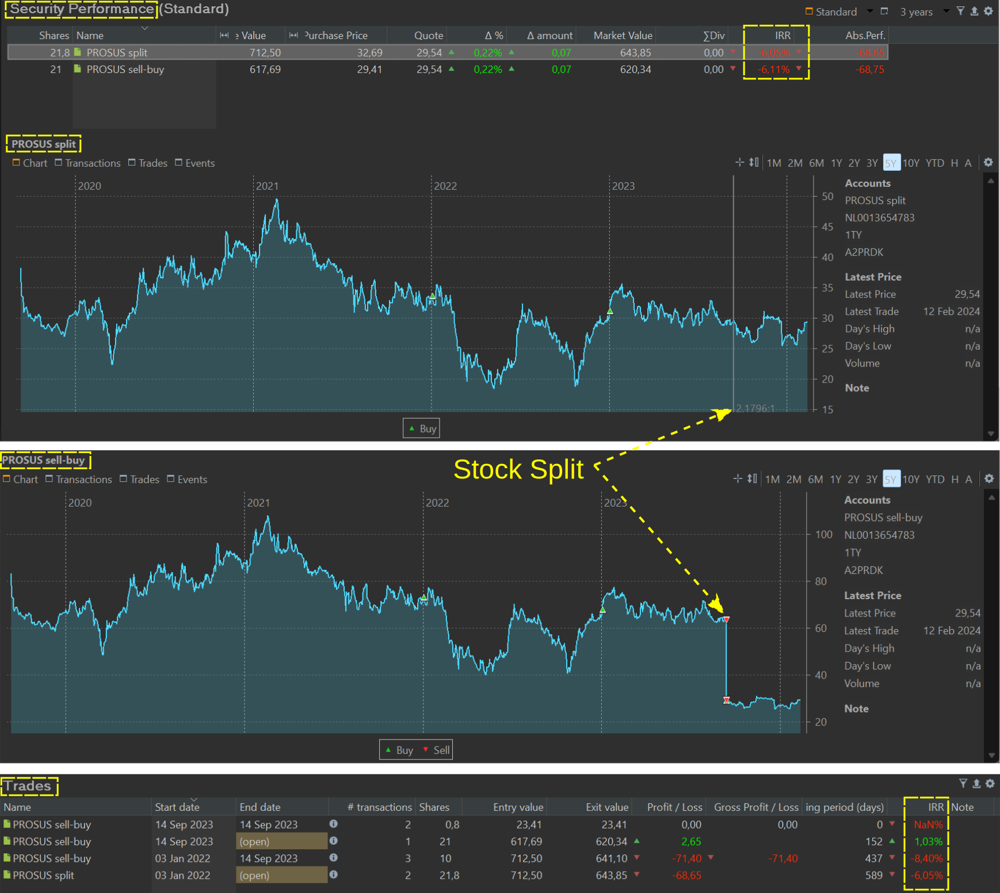

A stock split increases the number of shares in a company. For instance, following a 2-for-1 split, each investor will possess double the number of shares, and each share will be valued at half its previous price. A stock split leads to a reduction in the market price of individual shares but does not alter the total market capitalization of the company. Stock splits are frequently executed to make shares more accessible to a broader range of investors and enhance market liquidity. Conversely, a reverse stock split (1-for-5) entails fewer stock shares but at a higher price.

There are essentially two methods for recording a stock split in PP: using the built-in function or a sell-buy-back operation. Each method has its own set of advantages and disadvantages.

## Use of the built-in Stock split-function

PP currently supports stock splits via work-around; see the [discussion on the forum](https://forum.portfolio-performance.info/t/aktiensplit-buchen/11758). Essentially, it retroactively assumes that the shares have *always* been split. This ensures the correct number of securities in the portfolio *after* the split and maintains historically consistent cash flows and valuations, thereby preserving the security's performance. However, the number of shares *before* the split may not align with the real historical situation, potentially complicating the understanding of the security's history.

This change is destructive. It is not easily undone. If necessary, an improperly executed split can be corrected by executing a split with an inverse ratio. But perhaps a better approach is to create a backup copy of the portfolio file.

In the description of the Stock Split process in the [Reference Manual](../reference/view/securities/context-menu.md#stock-split), the example of the Amazon 20-for-1 stock split on June 6, 2022 is used. Please review this section first.

In Figure 1, the share price evolution over the last five years is depicted. Very noticeable, there is a massive drop on between June 3 and 6, 2022. On those dates, the closing prices were `$ 2447` and `$ 124.79`, respectively (but remember, you own 20 times more shares). Assume that you have purchased one (pricy) share on January 3, 2022 for the amount of `$ 3408`.

Figure: Historical Quotes chart of Amazon (unadjusted prices). {class=pp-figure}

Quite some confusion arises when you compare this chart with those from most other financial websites; for example, the 5-year chart from [investing.com](https://www.investing.com/equities/amazon-com-inc) looks very different.

Figure: Historical Quotes chart of Amazon (adjusted prices). {class=pp-figure}

Both charts span an identical five-year period. But, while your purchase price was `$ 3408`, it appears to be priced around `$ 150` around January 2022. This discrepancy arises because financial websites typically "adjust" all historical prices after a stock split. This adjustment involves recalculating the historical prices before the split, just as the PP's Stock Split function does.

Figure: Historical Quotes chart of Amazon (adjusted prices). {class=pp-figure}

!!! Important

    The "regular" Yahoo Finance Close Price is already adjusted for splits. The *Adjusted close* price is en surplus adjusted for splits and dividend and/or capital gain distributions.

**Some considerations**

- The built-in stock split function perfectly mirrors the approach adopted by most financial websites. This results in the Adjusted prices chart (Figure 3) being identical to those displayed on other platforms like investing.com or Yahoo Finance (Figure 2).

- It's crucial to recognize that the historical transactions *and* prices are permanently altered. This means that PP's records of past transactions will no longer accurately reflect the actual transactions as documented in your paper files. Over time, this may complicate the reconstruction of a security's history.

- A notable challenge arises when a split results in fractional shares, as seen in the case of Prosus' split announcement on September 14, 2023, with a ratio of 2.1796-for-1. In this scenario, 10 existing shares would be split into 21.796 shares. While PP can handle fractional shares, most brokers or banks cannot. Typically, they would adapt to this particular situation by issuing 21 new shares and providing compensation for the fractional share (0.796 shares in this case). Consequently, after the split, you'll need to record this compensation, which essentially involves executing a sell transaction of the fraction. Managing this process becomes notably more complex if you've made multiple purchases at different prices throughout the security's history.

## Use of sell-buy-back operation

An alternative method that keeps the historical prices and transactions intact is the following sell-buy-back procedure. At the split date (ex-date)

- Sell all the shares at the closing price of the day preceding the split. Don't record any fees or taxes as this is an  internal operation. Leave the historical prices intact.
- Simultaneously, on the same date, acquire a new quantity of shares equivalent to the theoretical outcome of the split (old quantity x split ratio). Ensure that the total purchase amount matches the selling value determined earlier.
- Round down the new share quantity to the nearest whole number. If there is a remainder, sell it at the same price as described in step 2.

Let's apply this workflow to the PROSUS split (2.1796-for-1) from above. Assume that you have bought 5 shares on 2022-01-03 on XETRA for 68.60 EUR per share and another 5 on 2023-01-03 for 73.90 EUR. The closing price on XETRA on 2023-09-13 was 64.11 EUR.

1. Selling old shares:
    - You have a total of 10 shares (5 bought on 2022-01-03 and 5 bought on 2023-01-03).
    - The closing price on XETRA on 2023-09-13 was 64.11 EUR.
    - Total selling value = 10 shares * 64.11 EUR/share = 641.10 EUR.

2. Purchasing new shares:
    - The split ratio is 2.1796-for-1.
    - The theoretical new amount of shares = 10 shares * 2.1796 = 21.796 shares.
    - The total purchase value must be the same as the selling value: 641.10 EUR.
    - Buy 21.796 shares for 641.10/21.796 or 29.41 EUR/share

3. Selling the remaining fraction:
    - Round down to the nearest integer: 21 shares.
    - Fractional share remaining after rounding down = 21.796 - 21 = 0.796 shares.
    - Sell the remaining fraction at the acquiring price, which is 29.41 EUR/share.
    - Value of the remaining fraction = 0.796 shares * 29.41 EUR/share = 23.41 EUR.

In Figure 4 a comparison of the two methods (built-in function vs sell-buy-back) is made. As can be seen, the price range is 15 - 50 for the built-in split and 20 - 100 for the sell-buy-back method. The original buying prices are preserved in the latter case. Of course, the graph wouldn't look as nice for the Amazon 20-for-1 split.

Figure: Comparison of the two methods (Prosus example).{class=pp-figure}

Please note that the security performance (top-right) is practically the same for built-in split vs sell-buy-back: IRR is respectively -6.05% vs -6.11%. The small difference is caused by the selling of the fraction (0.796 share) at a bad time (29.41 vs 29.54 EUR) in case of the sell-buy-back method.

The Trades Performance view gives additional info. Because we haven't solved the fractional share problem in the built-in split method, there is only one open trade: purchased 21.796 shares (2 x 10,898) and not sold yet. Remember that in your real bank account, you only have 21 shares. We haven't compensated for the fractional shares, which would be much more difficult in the built-in split method.

Let's compare with the sell-buy-back method. The open trade represents the 21 shares purchased on 2023-09-14. This trade has a positive performance (IRR = 1.03%). Prices have been increased since then. The previous period (the closed trade) however was negative (IRR= -8.40%). This puts the overall negative security performance of -6.11 in perspective. The IRR of the small closed trade of selling the 0.796 fraction is NaN (Not a Number). Because this trade is purchased and sold at the same price on the same day, the performance could not be calculated.