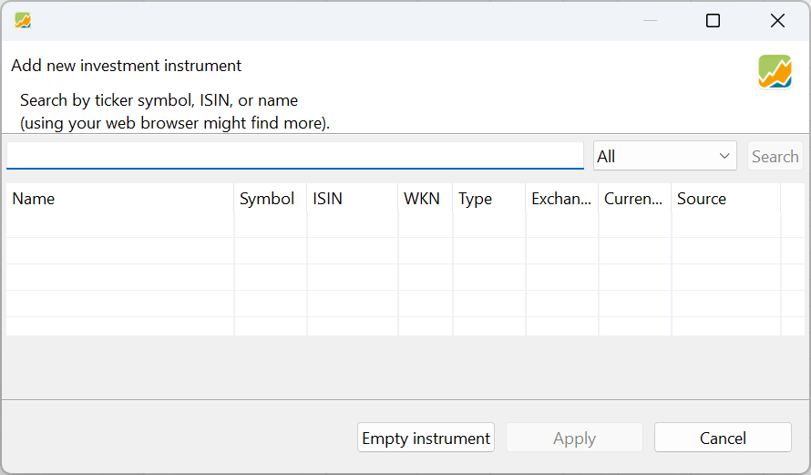
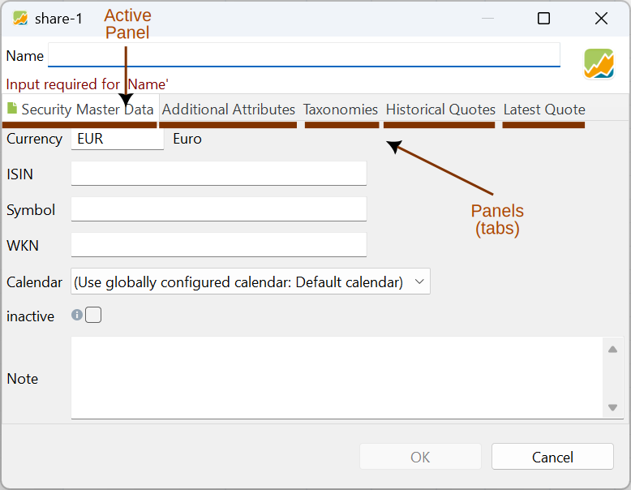
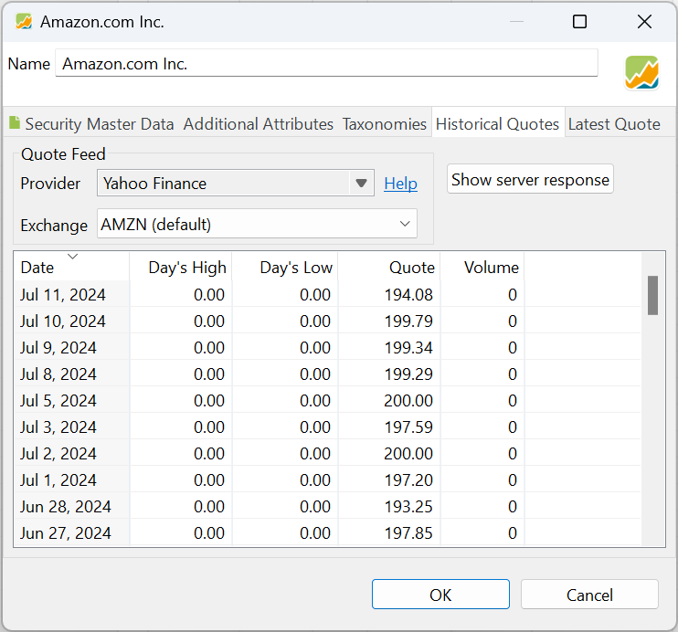

# File &#10095; New

With the `File > New` menu you can create the different assets PP can manage.

Figure: File > New submenu{class=pp-figure}

## Portfolio (File)

The option `File > New > File` initiates a wizard for creating a new portfolio. Within the wizard, you need to set the base currency of the portfolio, create a security and deposit account (mandatory), add additional deposit accounts, and include securities and taxonomies (optional). A detailed explanation of the wizard can be found in [Getting Started > Creating a Portfolio File](../../getting-started/create-portfolio.md).

## Security

The menu option `File > New > Security` is self-explaining: it allows you to create a new security. This can also be done at other locations within the UI; for example as part of the portfolio creation wizard (see above), or with the little green icon next to Securities in the side panel or in the `All Securities`view.

Figure: File > New > Security menu.{class=pp-figure}

You can either choose to create a new empty instrument (e.g. security) or to search for an existing one.  You can type (part of) the security name in the search box. Choosing from the drop-down box `All`, you can search for shares or bonds or both. After clicking the Search button, the list below will be populated with possible target instruments. The following fields are displayed for each instrument and will be used upon selecting the security.

 + Name: the full name of the security according to the data source (see below) from which it is retrieved, e.g. Yahoo Finance.
 + Symbol: the abbreviation (ticker) used by the data source.
 + ISIN: *International Securities Identification Number*. This is a unique twelve-digit code that is assigned to every security in the world. Mostly used by European brokers & banks.
 + WKN: *Wertpapierkennnummer*. A German six-digit alphanumeric code for the identification of a security, now replaced by the ISIN code.
 + Type: can be Share, Bond, Cryptocurrency, Aktie (German for stock or share), Währung (=German for currency), Futures, etf, fonds (= funds).
 + Exchange: a security may be traded on more than one exchange. For example, the NVIDIA stock is traded on Nasdaq (symbol NVDA, exchange NMS) or XETRA (symbol NVD.DE, exchange GER), and many more exchanges.  
 + Currency: this column seems to be always empty.
 + Source: these are the data sources for the search. [Yahoo Finance](https://finance.yahoo.com/) provides financial news and data including stock quotes, press releases, and financial reports. [CoinGecko](https://www.coingecko.com/) is a website with real-time information on most cryptocurrencies. [Portfolio Report](https://www.portfolio-report.net/search) is an open source project that aims to provide centralized portfolio performance data.

 Once the correct security has been selected, proceed to the next step by clicking on the Apply button. Some information such as name, symbol and historical quotes will already be filled in, based on the selected data source. You should always check the info, especially the stock market. All the info can be changed; even the name. Alternatively, one may initiate the process with an empty security (see Figure 3) and manually input the required information.

 Figure: Input panel for the creation of a security.{class=pp-figure}

 

 While only the `name` is obligatory, there are several other fields that need attention. They are grouped into 5 sub panels, marked with a yellow line in Figure 3.
 
 - ### **Security Master Data**
    
This panel is entirely visible in Figure 3. The `currency` field must correspond to the currency in which the security is traded. Once transactions are recorded with this security, the currency cannot be changed. Clicking the currency box will reveal a drop-down with all available currencies.

The fields `ISIN`, `Symbol`, and `WKN` have been explained earlier. The symbol field is particularly crucial as it is utilized in the Quote Feed for Historical Quotes (further details below).

The `Calendar` dropdown enables you to choose a specific stock market calendar, such as Euronext, London Stock Exchange, New York Stock Exchange, etc. These calendars contain information about trading days, (bank) holidays, affecting some calculations, the display of price gaps, and the execution of savings plans. A more detailed description is available in the `Help > Preferences > Calendar` menu.

A security can be set to active or `inactive`. If set to inactive, the security will not appear in buy or sell dialogs, and historical prices will not be updated automatically.

At the bottom of Figure 3, you can add a personal `note` for this security.

- ### **Additional Attributes**

    Besides the attributes from the Security Master Data, you can use other attributes; for example a logo. These additional attributes can be added to tables such as `Reports > Performance > Securities`. The values of these attributes must be entered manually and cannot be used in calculations.

    Additional attributes are defined in `(left) Sidebar > General Data > Settings > Attributes : Securities` (at the bottom). [More info here.](../view/settings.md#attributes-securities)

- ### **Taxonomies**

    A taxonomy serves as a classification system for your securities. For instance, the existing `Type of Security` taxonomy allows you to classify your securities into categories such as stock, Equity Fund, Exchange Traded Fund (ETF), Bond, Stock Option, Index, or Currency. It is essential to set the correct type in the Taxonomies panel when adding or editing the security (refer to Figure 3).

    Other valuable presets include Industries, aligned with the Global Industry Classification Standard (GICS), regions (up to country level), and assets (cash, equity, debt, and more).

    To access these taxonomies, navigate to the `Left sidebar > Taxonomies` (see Figure 6). Click on the `+ button` to view all presets or create your custom taxonomy.

- ### **Historical Quotes**

    For evaluating your portfolio, you need the current & historical prices of the security. In this panel (see Figure 4) you can set the data source of the `Quote Feed`. As `Provider`, you can choose between several alternatives: Yahoo Finance, Alpha Vantage, Quandl, ... (see Figure 5). You can even refer to a webpage (e.g. from an investor site) that contains these historical data; an example is given in [Import fund data from Morningstar](../../how-to/morningstar.md). Or you can create them yourself and import the quotes from a csv-file. 
    
    Figure: Historical quotes panel.{class=pp-figure}

    
    
    Depending upon the chosen provider, you may need to input additional information. If the provider is a website, you need to specify an URL. If the provider covers more than one `Exchange`, you need to select the correct one.

    Figure: Historical quotes panel.{class=pp-figure}

    

    Downloading historical prices for large-cap (big companies) stocks is relatively straightforward. However, obtaining data for less common stocks, mutual funds, bonds, bitcoin, etc., can sometimes be more challenging. We explore these topics in depth in [Downloading Historial Prices](../../how-to/download-historical-prices.md) in the how-to section.   

- ### **Latest Quote**

    The Latest Quote panel is very similar to the Historical Quotes panel. Here, you can configure values for **real-time values** such as Latest Price, Latest Trade, Day's High, Day's Low, and Volume. 
 
## Cryptocurrency
Specifically for adding and managing cryptocurrency-related information within the portfolio.

## Exchange Rate

Used for handling exchange rate information, which is crucial for portfolios involving multiple currencies.

## Consumer Price Index

for incorporating consumer price index data, providing a macroeconomic indicators for financial analysis.

## Taxonomy

Used for managing classifications or categorizations of assets based on a defined taxonomy.

## Watchlist

Used for creating and managing watchlists, allowing users to monitor specific securities or assets without direct ownership.
