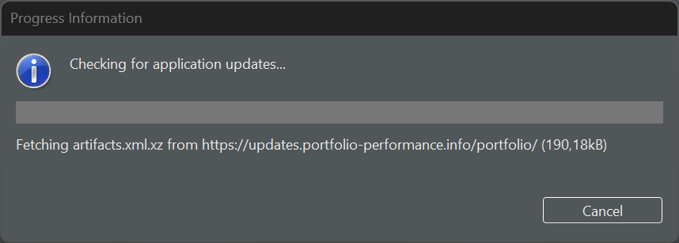
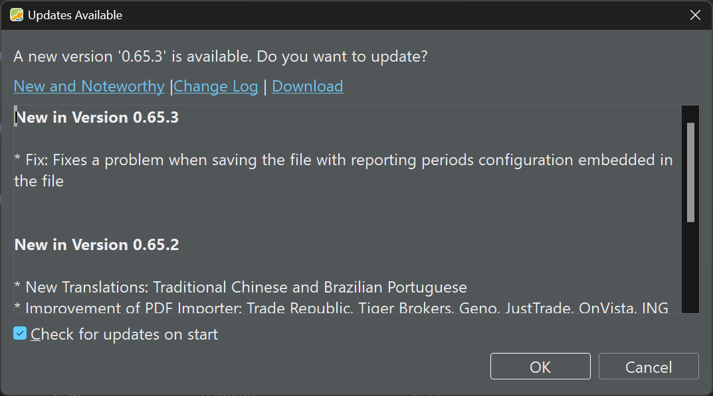
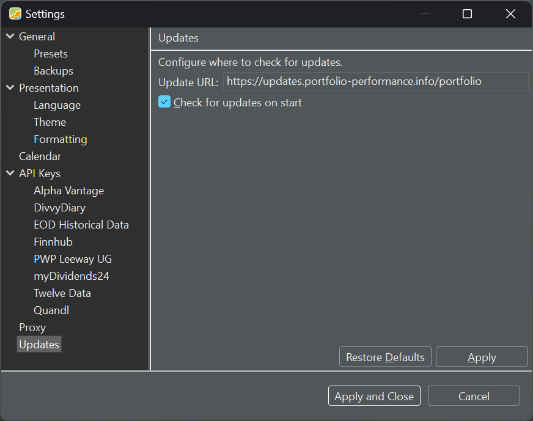

After the first installation, you can either check manually for updates or allow the program    to check each time it starts.

## Manual check for updates

To manually check for updates, navigate to the menu `Help > Check for Updates ...`. Figure 1 will briefly appear.

Figure: Checking for updates.{class=pp-figure}

Either no updates are available; indicating that your version is up-to-date or figure 2 will be shown; the correct version will of course be different in the future.

Figure: Checking for updates.{class=pp-figure}

To install the updated version, click `OK`. To cancel the update and stay with the old version, click `Cancel`.

There is link to [New & Noteworthy](https://forum.portfolio-performance.info/t/neues-nennenswertes/23/148). This webpage provides detailed information about the changes in each program version. Unfortunately, the link in the program directs to the German website. An [English version](https://forum.portfolio-performance.info/t/new-noteworthy/17945/1) is also available.

The second link leads to the [Change Log](https://www.portfolio-performance.info/versions.html). Although this webpage is in German, a bilingual version (German-English) can be found on[Github](https://github.com/portfolio-performance/portfolio/releases).

The [download link](https://www.portfolio-performance.info/) takes you to the homepage (German version); where you can download the program in different versions; see [Getting Started > Installation](../../getting-started/installation.md).

Below the links, you can find an overview of the changes in the last few releases. At the bottom right, you can enable the automatic check for updates (see below).

## Automatic check for updates

Automatic checking for updates is enabled by default. You can change this behavior in the menu `Help > Settings > Updates > Check for updates on start` (see figure 3).

Figure: Setting for automatic check for updates.{class=pp-figure}

## Updating error

If the program is corrupted or some files are missing, automatic updates are not feasible. An error message (see figure 4) is displayed, and the automatic update is no longer possible.

The simplest workaround is to delete the program and reinstall it.

Figure: Error message upon manual check for updates.{class=pp-figure}

