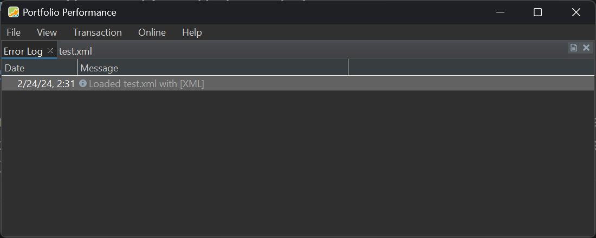

On rare occasions, the PP app may not function properly or even crash. Beneath the Help menu, three options can assist in such instances.


## Show/Save Error Log

Every time the program starts, it creates a log-file. It is saved automatically in your User directory e.g. for Windows users in `C:\Users\Your-name\AppData\Local\PortfolioPerformance\workspace\.metadata\`. You can view this log file within the PP app in a separate window with the command `Help > Show Error Log`. Double-clicking the message will display the entire text. If there were no errors, this will be a minimal log (see Figure 1).

Figure: Minimal Error Log after successful start-up. {class=pp-figure}



This changes drastically when an error is encountered. A large text file will appear when double-clicking the message (see below).

```
!SESSION 2024-02-19 11:47:29.300 -----------------------------------------------
eclipse.buildId=0.67.3.
java.version=17.0.5
java.vendor=Azul Systems, Inc.
BootLoader constants: OS=win32, ARCH=x86_64, WS=win32, NL=en_US
Command-line arguments:  -os win32 -ws win32 -arch x86_64

This is a continuation of log file C:\Users\your-name\AppData\Local\PortfolioPerformance\workspace\.metadata\.bak_0.log
Created Time: 2024-02-19 13:18:06.540

!ENTRY name.abuchen.portfolio 4 0 2024-02-19 13:18:06.540
!MESSAGE 404 Not Found --> https://query1.finance.yahoo.com/v8/finance/chart/TNET.BR?lang=en-US&region=US&corsDomain=finance.yahoo.com
!STACK 0
name.abuchen.portfolio.util.WebAccess$WebAccessException: 404 Not Found --> https://query1.finance.yahoo.com/v8/finance/chart/TNET.BR?lang=en-US&region=US&corsDomain=finance.yahoo.com
	at name.abuchen.portfolio.util.WebAccess.executeWith(WebAccess.java:222)
	at name.abuchen.portfolio.util.WebAccess.get(WebAccess.java:182)
	at name.abuchen.portfolio.online.impl.YahooFinanceQuoteFeed.rpcLatestQuote(YahooFinanceQuoteFeed.java:61)
	at name.abuchen.portfolio.online.impl.YahooFinanceQuoteFeed.getLatestQuote(YahooFinanceQuoteFeed.java:69)
	at name.abuchen.portfolio.ui.jobs.UpdateQuotesJob$1.run(UpdateQuotesJob.java:244)
	at org.eclipse.core.internal.jobs.Worker.run(Worker.java:63)


```
Part of this text can be helpful when seeking assistance in the [forum](https://forum.portfolio-performance.info/) or when reporting an [issue on GitHub](https://github.com/portfolio-performance/portfolio/issues).

## Save Error Log ...

This command will allow you to save the latest log to a text-file with extension `.log`.

## Debug: Reset UI ...
Choosing this option will simply display the dialog boxes of Figure 1 & 2. As you can see, you need to quit and restart the application after that.

Figure: Reset GUI dialog box. {class=pp-figure}


Figure: Successful reset of UI. {class=pp-figure}


The Reset UI function will NOT delete any created views or custom reporting periods, nor will it reset the Recent Files list, as these parameters are saved separately.

However, it does reset the position and size of the PP application window on your monitor and does not restore open files from the moment of closing. Additionally, it sets the main and information panes to their initial values. In essence, as the name implies, it resets the Graphical User Interface (GUI/UI).

In the event of unexpected errors, initiating a Reset UI could be your initial troubleshooting step, as it minimally disrupts your workflow.


## Updating error

If the program is corrupted or some files are missing, automatic updates are not feasible. An error message (see figure 4) is displayed, and the automatic update is no longer possible.

The simplest workaround is to delete the program and reinstall it.

Figure: Error message upon manual check for updates.{class=pp-figure}

