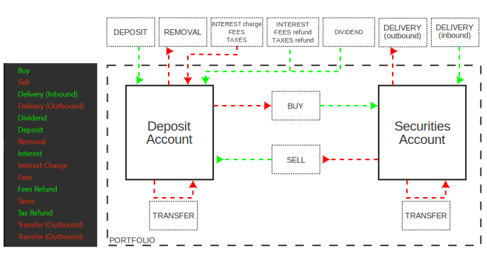

Figure: Transaction menu. {class="align-right "}

A financial transaction is an agreement between a buyer and seller to exchange goods, services, or assets for payment. In case of PP, the exchange is about securities. Transactions are the core of PP. You can divide them broadly into security and deposit transactions (see figure 1).

- Security transactions: buy, sell delivery (inbound), and delivery (outbound).
- Deposit transactions: deposit, removal, interest, interest charge, fees, fees refund, taxes, tax refund.
- A dividend is a special deposit transaction. The cash is coming from the dividend payment of the security.

Security transfer ... and Transfer between accounts ... aren't real transactions but manual operations between accounts.

Figure: Transaction types. {class="pp-figure"}

Buy and sell transactions are the most common. When you buy a security, it increases the value of the Security Account (shown in green) and decreases the balance in the Deposit Account (shown in red). Conversely, when you sell a security, it has the opposite effect.

A Delivery (inbound) is similar to a buy transaction but has no impact on the Deposit Account; only the Security Account increases. This operation is typically used when you need to inherit a security. Delivery (outbound) functions in the opposite manner.

To increase the Deposit Account balance, you can use a Deposit transaction, while a Removal transaction is used to decrease it.

Additionally, you can receive a dividend, interest, a refund of fees or taxes. This is similar to a Deposit transaction, but with the added option of linking this deposit (dividend, interest, ...) to a Security account. Conversely, when you need to pay fees or taxes or are charged interest, it causes a Removal of a deposit, but also allows for the possibility of linking it with a Security account.