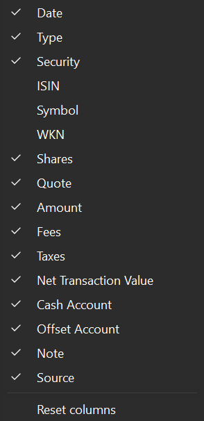
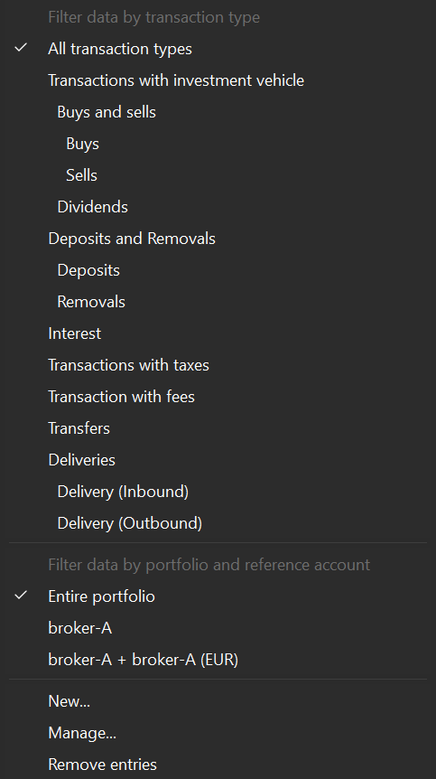

# View &rsaquo; Accounts &rsaquo; All Transactions

The `All Transactions` view displays a table with all the transactions of the portfolio in the main pane, sorted by the transaction's creation time in the portfolio (see Figure 1). The default view presents the columns `Date`, `Type`, `Security`, `Shares`, `Quote`, `Amount`, `Fees`, `Taxes`, `Net Transaction Value`, `Cash Account`, `Offset Account`, `Note`, and `Source` (see the [Glossary](../../../concepts/PP-terminology.md) for a definition of these terms).

Figure: The All Transactions View.{class=pp-figure}

Although it's less useful than in the `All Securities` view, the information pane at the bottom (not shown in Figure 1) can provide additional details about the security attached to the selected transaction in the main pane.

Figure: The Show or Hide columns button (gear).{class=align-right style="width:30%"}

Click the column heading to sort the table in ascending (&and;) or descending (&or;) order based on that column. You can rearrange any column by dragging its header. Drag the divider line between two columns to adjust the with of the left column or double click to best fit. You can rename or hide a column with the context menu (right-click on the column header). Adding, deleting or resetting the columns to their original layout is done with the Show or hide columns icon (gear symbol top right). The default columns are shown in Figure 1; they are also checked in Figure 2. Figure 2 gives a list of all available columns.

As can be seen, all available columns are displayed except `ISIN`, `Symbol`, and ´WKN´, which are typically security related terms (see the [Glossary](../../../concepts/PP-terminology.md)).

In a typical portfolio, the transaction table can contain hundreds of rows. However, you can use the search function to narrow down the displayed rows. This function scans all cells in each column, and if the cell contains the search value, the corresponding transaction (row) will be displayed. For example, entering `share-3`in the Search box of Figure 1, will narrow the list down to the first row. Entering `share` (or for that matter `sh` is enough) will display all transactions with the security column (in fact every column) containing the word `share`. You can not use wildcards such as * or ? in the search function.

Figure: The Filter Securities button.{class=align-right style="width:30%"}

Another method to limit the number of transactions is by using the "Filter Securities" button located in the top right corner of the interface. Figure 3 showcases all potential options available. By default `All transaction types` of the `Entire portfolio` is displayed in the table.