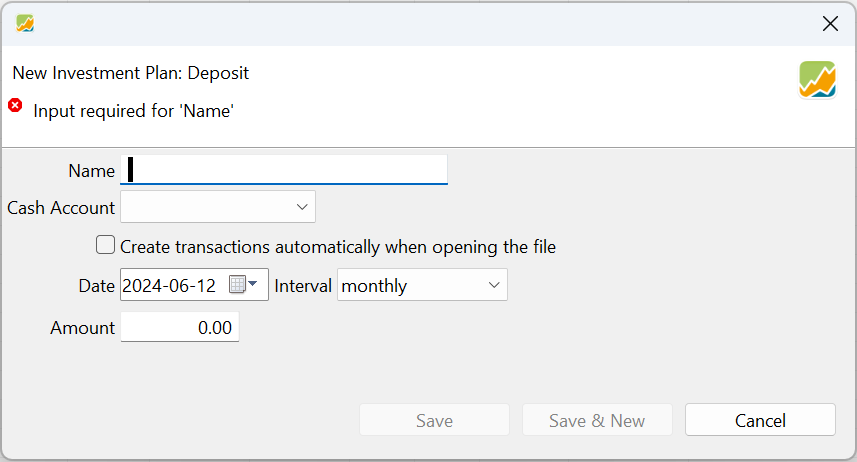
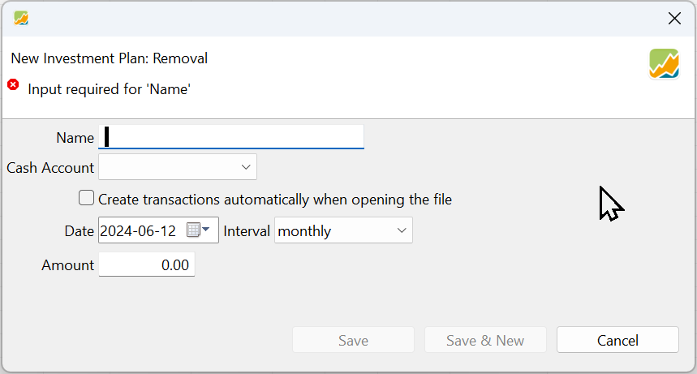
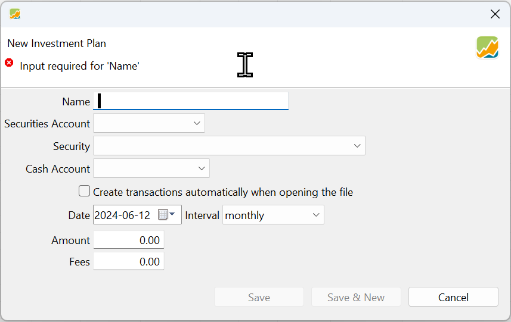

An investment plan is an automated method to facilitate periodic deposits or withdrawals (removal) of funds from a deposit account or the investment in a specific security (through buy or inbound delivery transactions). It allows you to systematically invest or withdraw funds at regular intervals with minimal manual input.

## Types of investment plans

Figure: Three investment plans in main pane and generated transactions of plan-3 in information pane. {class=pp-figure}

There are three main types of investment plans: deposit, removal (withdrawal), and Security Purchase/Delivery (as illustrated in Figure&nbsp;1). A deposit plan will increase the balance of a cash account, while a removal plan will decrease it. On the other hand, a Security Purchase/Delivery plan involves both decreasing your deposit account (to fund the purchase of securities) and increasing your security account (as you acquire new securities). To create a new plan, simply click the 'New Plan' :octicons-feed-plus-16: button, located at the top right corner of the interface (as shown in Figure 1).

### Deposit Investment Plan

Figure: Deposit Investment Plan. {class=pp-figure}

With a deposit investment plan, you can regularly deposit a specified amount of money into a designated cash account. To set up a deposit plan, you will need to provide a descriptive name (such as `plan-1`), the name of the cash account, the amount of money to be deposited, the starting date of the plan, and the frequency (interval) of the deposits (ranging from every month to every 12 months). The starting date could also be in the past or the future.

Once you click the `Save` button, the information will be added to the main pane of the investment plans (as shown in Figure 1), but the plan will not be executed immediately. No transactions will be performed at this stage. However, if you have checked the `Create transactions automatically when opening the file`, the plan will be executed automatically the next time you open the file.

Alternatively, you can click the 'Save & New' button to add the plan to the list and reopen the dialog box. This allows you to create multiple deposit plans in quick succession.

### Removal Investment Plan

Figure: Removal Investment Plan. {class=pp-figure}

With a removal investment plan, you can periodically withdraw a specified amount of money from a designated cash account. The process of setting up a withdrawal plan is similar to that of a deposit plan. You will need to provide a descriptive name for the plan, the name of the cash account to be used, the amount of money to be withdrawn, the starting date of the plan, and the frequency of the withdrawals. The same fields that were used to create a deposit plan will be required for a withdrawal plan.

### Security Purchase/Delivery Investment Plan

Figure: Security Purchase/Delivery Investment Plan. {class=pp-figure}

With a Security Purchase/Delivery investment plan, you can regularly acquire a specified security using funds from a designated cash account. As shown in Figure 4, you will need to provide a descriptive name for the plan (such as `plan-3`), the name of the security account and the specific security to be acquired, the name of the cash account from which the funds will be withdrawn, the starting date of the plan, the frequency of the purchases, the amount to be invested each time, and any associated fees.

It's important to note the distinction between purchase and delivery when selecting the cash account. If you want to acquire the security through delivery, you should use the `(Inbound Delivery)` option. On the other hand, if you want to purchase the security, you should use the name of an existing cash account from which the funds will be withdrawn.

The following fields/columns are displayed in the main pane (see Figure 1): `Name`, `Security`, `Securities Account`, `Cash Account`, `Start Date`, `Last Execution`, `Next Execution`, `Interval`, `Auto-Generate`, `Amount`, and `Fees`. Most fields are self-explanatory. The `Auto-Generate` field is automatically set when the `Create transactions automatically when opening the file` option is selected during the initial creation of the plan. Two additional fields, `Notes` and `Attributes`, can be added using the `Show or Hide` button (gear symbol at the top right). For information on how to manipulate individual columns, please refer to the [All Transactions section](../accounts/all-transactions.md/#settings) in the manual.

## Managing Investment plans

The main pane of Figure 1 displays a comprehensive list of all investment plans in the portfolio. By using the context menu, which can be accessed by right-clicking a plan, you have the ability to generate transactions, modify the selected investment plan, or remove it entirely.

### Generate Transactions

-  If the option to `Create transactions automatically when opening the file` was selected during the creation of the plan, the transactions will be automatically generated the next time the file is opened.
- Selecting the `Generate Transactions` command will instantly create all feasible transactions, subject to the specified date constraints.  
- Deposit, withdrawal (removal), or Purchase/Delivery transactions are generated from the start date. If the start date falls on a holiday (see Help > Preferences > Calendar) or weekend, the transaction will be moved to the next working day.
- The `Last Execution` column will display the most recent date on which the transaction-generating algorithm was executed. The `Next Execution` column will indicate the earliest future date on which a transaction is scheduled to occur, based on the frequency and last execution date.
- You cannot accidentally run the plan twice. As long as the current date is before the `Next Execution` date, the `Generate Transactions` command will have no effect.

### Editing a plan

- It is possible to edit/change a plan after its initial creation. All fields are editable. For example, if the initial plan was set to occur every 2 months, you can change it to monthly, and any missing monthly transactions will be added upon the next generation of transactions.
- However, you cannot delete existing transactions by editing the plan. For example, if you revert back to a plan that occurs every 2 months, the added monthly transactions will not be deleted.

### Deleting a plan

- Use the context menu to delete an investment plan completely.
- Deleting a plan will also delete all of the accompanying transactions that were generated. If you want to keep one or more transactions, you have to duplicate them (Right Click > Duplicate Transaction) before deleting the plan.

## Generated Transactions

The information pane of the Investment Plans view provides a comprehensive list of all the transactions that have been automatically generated from the selected investment plan in the main pane. It's important to note that this list does not include any manually created purchase transactions on this security. The information pane is specifically designed to display *only* the generated transactions that result from the implementation of an investment plan, allowing for easy monitoring and analysis of the plan's performance.

You can edit or delete some or all of the generated transactions without affecting the plan itself. For instance, a generated purchase will probably not reflect the actual buying price, as it is based on the closing quote of the day. You may need to modify the details, e.g. the purchase price of a generated transaction after it has been created.

If the most recently generated transaction is deleted, the `Last Execution` field in the main pane will also be cleared.

The chart menu in the Investment Plans view is identical to the chart menu in the [All Securities menu](../../../reference/view/securities/all-securities.md/#chart-menu). The same applies to the Historical Prices.