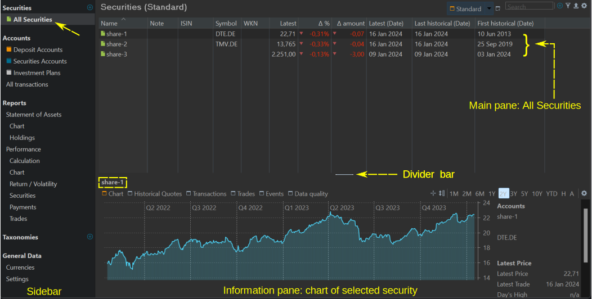
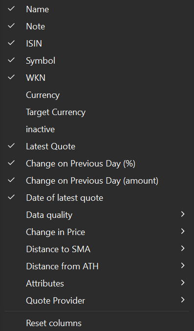
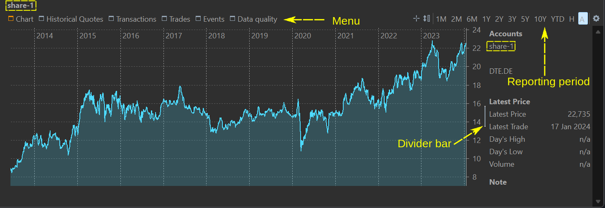
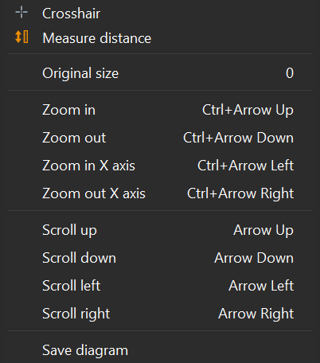
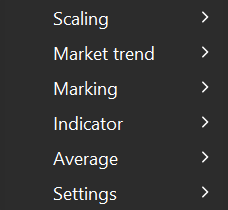
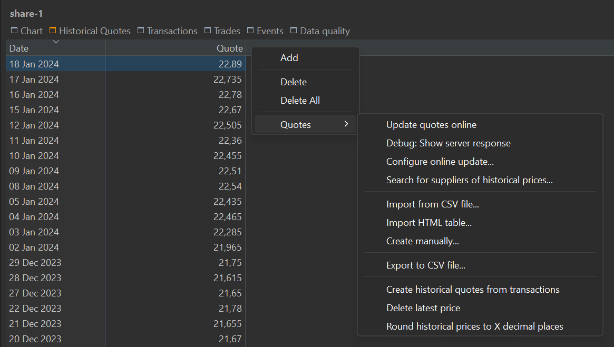
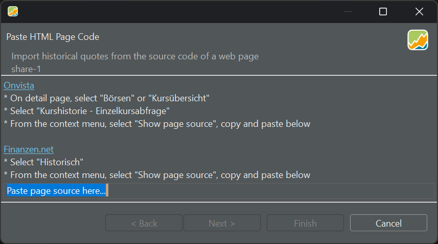

As the name implies, this list contains all the securities you are monitoring (&ne; purchased). To view the securities currently in your portfolio accounts, navigate to `Reports > Statement of Assets`.

Figure: View All Securities.{class=pp-figure}

This view contains two panels. The top panel is a list of all available securities. You can select multiple securities, but only one of them can be active. The bottom panel features a graph of the active security.

## Top panel: list All Securities

Figure: All available columns.{class=align-right style="width:30%"}

The top panel represents essentially a table with all the available securities listed. Click the column heading to sort the table based on that column. You can rearrange any column by dragging its header. Drag the divider line between two columns to adjust the with of the left column. You can rename or hide a column with the context menu (right-click on the column header). Adding, deleting or resetting the columns to their original layout is done with the `Show or hide columns` icon (gear symbol top right). The default columns are shown in Figure 1; they are also checked in Figure 2. Figure 2 gives a list of all available columns.

Refer to the [glossary](../../../concepts/PP-terminology.md) for a definition and short explanation of the columns.  Note that the column heading is sometimes different from the field name e.g. &Delta; amount and that several fields are collapsed into a single category e.g. Data Quality.

Figure 1 represents the `Standard` view. A view keeps a record of the visible columns, their widths, column headings, and the sorting order of the table. By clicking the triangle icon next to the button, you can access options to duplicate, rename, or delete the current view.

If you find yourself needing a custom layout regularly, you can duplicate the standard view, give it a new name, and customize it to your preferences. The newly created view will be placed to the right of the Standard view. Or you can use the `New View` button (left of the Search box) to create a new view based on the default setup.

With the Search box you can filter the list of visible securities. For example, entering "DE" in the Search box will only display share-1 and share-2 because their ticker symbol contains the string "DE".

The Filter icon is used as a more categorical filter. Available options are: Only active instruments, Only securities, Only exchange rates, Shares held &ne; 0, Shares held = 0, and Securities: Limit price exceeded. For the latter, you need to create a new attribute of type “limit price” in the [settings](../settings.md) of the portfolio (menu View > Settings). Then you can add this column to the table and enter some values.

The table displayed in the current view can be exported as a CSV file, preserving the number of rows and columns along with their (custom) column headings.

By dragging the divider bar, you can adjust the size of the top panel, making it larger or smaller. You can even extend it to completely occupy the canvas or hide it entirely. The divider bar becomes visible when hovering over with the mouse.

## Bottom panel

The bottom panel showcases by default a graph or chart of the active security, namely the last one selected in the top panel (refer to Figure 3). The graph is updated each time a different security is selected in the top panel.

Figure: Graph of active security from top panel.{class=pp-figure}

### Chart menu

The `Chart menu` turns orange when selected and displays a line graph/chart of the active security. To the right of the graph, detailed information about the security is displayed such as ticker symbol, latest price, .... With the vertical divider, you shrink or expand this area to show more or less of the graph. Drag the divider all the way to the right to completely hide this section. The divider bar becomes visible when hovering over with the mouse.

With the reporting period menu, you can set the time frame of the graph; going from 1 month (1M) until 10 years (10Y). This period is always measured from today minus the period. The x-axis of the chart is subdivided into months (1M, 2M, and 6M), quarters (1Y and 2Y), 2 quarters (3Y), or years (5Y and 10Y). You can also select the YTD (Year-to-Date) option; from January 1th of this year until today. The option H stands for the complete holding period of the security (=from the purchasing date until now), while A displays "All available data"; from the first until the last historical price.

If you click and hold on the graph, you can view the date and price of the security at that particular moment. If there are additional markers, such as number of shares or a time series like the Simple Moving Average (SMA), they will also be displayed. To sort these entries by value, you can press the Alt key and click.

Clicking on the first icon (crosshair) of the reporting period menu displays a large crosshair above the graph. The origin (0,0) is at the mouse position of the click. The vertical axis will reveal the position on the x-axis or the exact date. The horizontal axis will display the historical price of the security on that day.

 
With the second icon (Measure distance) you can determine the exact number of days between two points on the chart. It also displays the difference in historical price and the corresponding percentage between the two points.

Figure: Context menu of the graph.{class=align-right style="width:30%"}

Both options can also be accessed by the context menu (right-click on the graph).

- Original size: Restores the chart to the default of the selected time period. The number 0 functions here as the accelerator key. 
- Zoom in/out: Display more detail (in) or less detail (out) on y-axis. The zooming can be done with the accelerator keys or with the middle mouse wheel.
- Zoom in/out X axis: Show a more detailed (in) or less detailed timescale (out)
- Scroll up, down, left, right: navigate on the y-axis to the top (up) or bottom (down) or in the x-axis to an earlier time (left) or later time periods (right)
- Save diagram: Allows you to save the graph as an image in PNG or JPG format.

Figure: Context menu of the graph.{class=align-right style="width:30%"}

With Configuration chart icon (gear at the top right) you set numerous additional data on the graph. Figure 5 displays the collapsed view.

- Scaling (applies to the y-axis)
    - Linear: A linear scale is evenly spaced, where each unit on the scale represents an equal difference in value.
    - Logarithmic : A logarithmic scale doesn't have a constant spacing between values. Each step represents a power of 10 increase e.g. 1, 10, 100, 1000. The scale compresses large ranges into a more manageable visual representation and highlight relative changes.

- Market trend: An additional horizontal axis is displayed.
    - Market trend: In addition to the standard horizontal axis that displays historical prices of the security, there is an extra horizontal axis intersecting the y-axis. This additional axis is positioned at the average market price for the selected reporting period. It provides a reference point, allowing you to compare individual prices on the graph to the average market price during the specified period. 
    - Market trend vs. Purchase Value: The additional horizontal axis intersects at the level of the purchase price of this security. 
- Marking: Additional symbols can be incorporated onto the graph to convey specific information or highlight key data points.
    - Investments: Buy (delivery inbound) and sell (delivery outbound) transactions are marked by respectively a green up-pointing triangle and a red/orange down-pointing triangle.
    - Shares: An additional step-line is overlaid on the graph, depicting the number of shares at any given moment in time. 
    - Dividends: Dividends are illustrated on the graph using a small blue rectangle. Given that dividends typically constitute a fraction of the market price, the marker is positioned in close proximity to the origin of the y-axis.
    - Events: Event descriptions are included at the bottom of the graph, aligned with the appropriate dates. Additionally, a small dashed vertical line is displayed on the graph at the date corresponding to each event.
    - High/Low: A green up-pointing arrow (high) and a red down-pointing arrow (low) are added to the chart at the positions where the security reaches it highest or lowest quote.
    - Purchase Value (FIFO): A pink step-line is super-imposed on the graph, representing the [purchase value](../../../concepts/purchase-value.md) at that moment in time. The purchase value is calculated using the First-in, First-out method.
    - Purchase (moving average): Similar to the FIFO method, a pink step-line is added to the graph, illustrating the purchase value at each moment in time. However, in this case, the calculation method follows the [moving average](../../../concepts/purchase-value.md) principle. 
    - Show limits: before enabling this option, one has to create a new [Security Attribute](../settings.md#attributes-securities) of type Limit Price.  You should also add this attribute as an [Additional Attribute](../../file/new.md#security-master-data) to your security. Enter as limit for example `> 17` (see Figure 6). An orange horizontal bar will appear at the value of 17.

        Figure: Chart with limit price indication. {pp-figure}

        

- Indicator
    - Bollinger Bands: Consist of three bands/lines – an upper band, a middle band, and a lower band – that are plotted on a price chart. The middle band (dashed) is the simple moving average (SMA) of the security's price over a specified period. The upper and lower bands are +1/-1 standard deviation of the price from the middle band.
    - MACD: Stands for [Moving Average Convergence Divergence](https://www.investopedia.com/terms/m/macd.asp). It is a popular momentum indicator used to analyze the strength and direction of a trend in a security's price.
- Average
    - Simple Moving Average (SMA) (5, 20, 30, 38, 50, 90, 100, 200 days): For each point in time, a SMA is calculated and plotted on top of the graph.
    - Exponential Moving Average (EMA) (idem days): While the SMA gives equal weight to all data points in the calculation, the EMA assigns greater weight to more recent prices and less weight to older prices. This makes the EMA more responsive to recent price changes.
- Settings
    - Show with Marker Lines: When marking is enabled (as described above), a vertical marker line is presented on the chart in the corresponding color, accompanied by the value adjacent to the vertical line.
    - Show Data Labels: Alternatively, when data labels are activated, the value of the marker is displayed directly beside the marker symbol instead of placing it next to the vertical line. 
    - Show missing trading days: Enabling this option will draw small vertical bars at the position where historical quotes are missing for a regular business day (see for example Figure 6).
    - Percentage axis (secondary): a new Y-axis is added at the left border of the graph. The scale is expressed in percentage, with the initial buying price set to 0%.
    - Horizontal lines (Value axis): if a secondary percentage axis is visible, dashed horizontal lines can be aligned with the primary value axis (this option) or with the secondary percentage axis (the following option).
    - Horizontal lines (Percentage axis): either this option or the previous one should be enabled. With this option, the dashed horizontal lines are aligned at percentage levels.

### Historical Quotes

The Historical Quotes menu in the bottom panel reveals a two-column table displaying the date and quote of the selected security in the top panel (see Figure 6). Clicking on a column header will sort the table in ascending or descending order based on that column. You can rearrange the columns by dragging the header.

Double-click on the date or the quote to modify its value. Be careful when changing the date, as the new quote will overwrite any quote registered for that date.

Utilize the "Export data as CSV" feature (icon to right) to save the entire table as a CSV file. The context menu (right-click) offers various management options.

Figure: Context menu of Historical Quotes in bottom panel.{class=pp-figure}

- Add: This option enables you to input the date and corresponding quote for the security. You can add quotes for any valid date, even in the future.

- Delete: To delete one or more rows, make a selection. For a consecutive selection, click the first row, press Shift, and click the last row. For a non-consecutive selection, use the Ctrl key. Utilize the context menu to delete the selected rows.

- Delete All: This command removes all historical quotes in the table. Note that this action cannot be undone.

- Quotes: this heading conceals several additional options (see Figure 6). Many of these options can also be executed from another context, e.g. menu.

    - Update quotes online: Shortcut for the [menu Online > Update quotes (selected security)](../../online.md#update-quotes-selected-security).
    
    - Debug: Show server response: If the security is linked to an online data provider, you can view the HTTP response from that server.
    
    - Configure online update ...: this option will display the Securities attributes panel with the Historical Quotes tab selected; see [File > New](../../file/new.md#historical-quotes).
    
    - Search for suppliers of historical prices ...: displays the first step of the [File > New](../../file/new.md#file-❯-new) wizard.
    
    - Import from CSV file ...: This command is equivalent with the [File > Import](../../file/import.md) menu. The CSV file must contain at least two columns.
    
    

    - Import HTML table ...: This option lets you import a table with historical Quotes that you can find on a webpage. Some examples are given (see Figure 7). {#import-html-table}
        
        Figure: Import HTML table from context menu Historical Quotes. {class=pp-figure}

        

        For example, navigate to [https://www.finanzen.net/historische-kurse/nvidia](https://www.finanzen.net/historische-kurse/nvidia). You could also search for the security at the homepage. Enter a start and end date and a marketplace. NVIDIA is listed on XETRA. Click on Suchen (Search). Right-click the table and select View Page Source in the contaxt menu. Copy and paste everything in the PP.   
    - Create manually: This command is identical with the `Add` option above.

    - Export to CSV file ...: This command is identical with the `Export button` (top right).

    - Create historical quotes from transactions: If a security has transactions (buy or sell), the quote price associated with these transactions can be included into the historical prices. The transaction price takes precedence and will overwrite any existing historical quote on that date.

    - Delete latest price:

    - Round historical prices to X decimal places: When rounding a value like 99.994 to two decimals, the result will be 99.99, whereas the value of 99.995 will round up to 100.00. Keep in mind that it's not possible to round a number to a higher precision than originally available. Attempting to round the previous number to 4 decimal places, for example, will not change the number.

