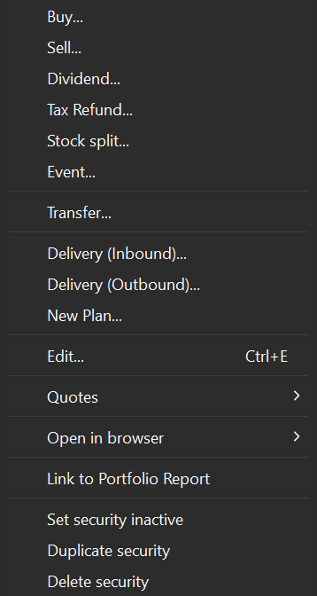
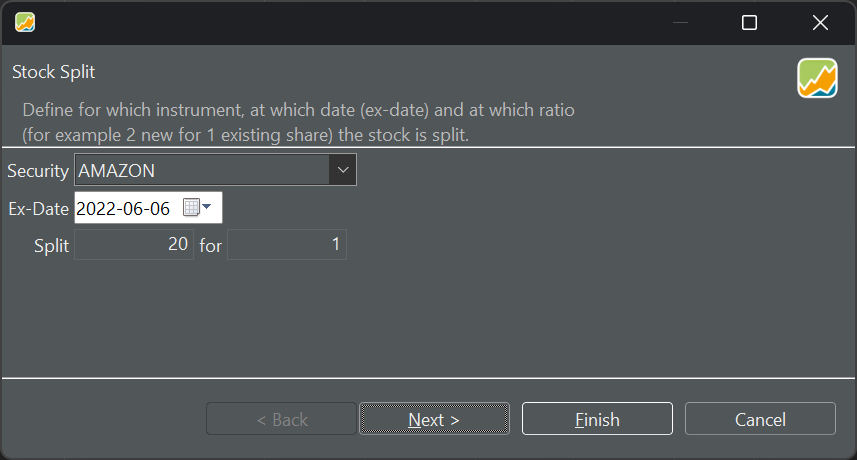
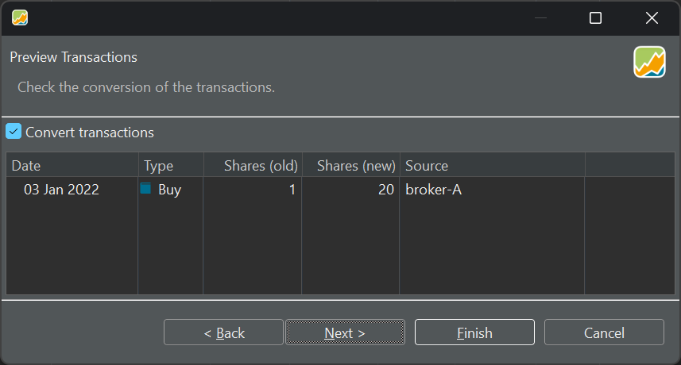
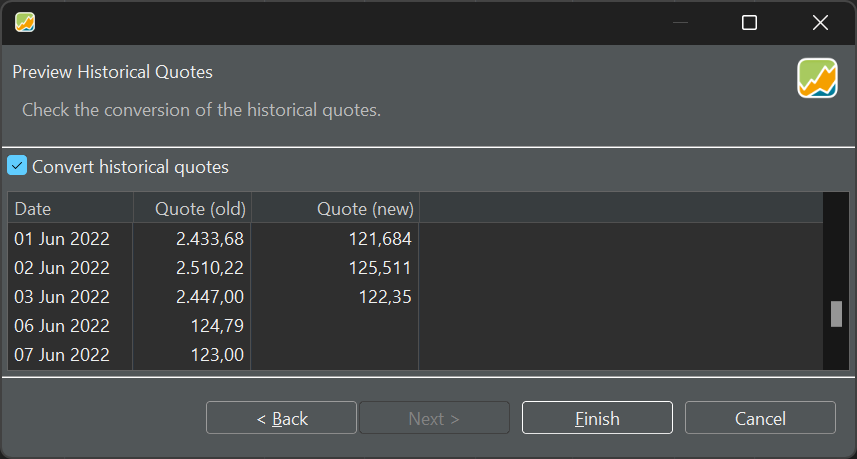
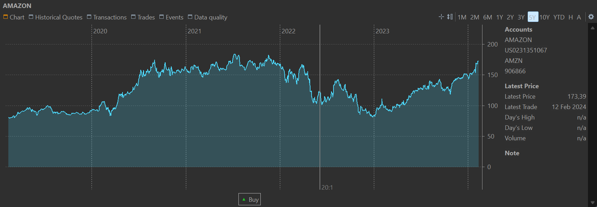

Figure: Context menu of a selected security.{class=align-right style="width:30%"}

The context menu of a security contains several additional options that are not available within the `view menu`. You can access the context menu by selecting a security or a security view (e.g., securities account) and right-clicking. A pop-up, as shown in Figure 1, will be displayed.

## Stock split ...

A stock split increases the number of outstanding shares by issuing additional shares to current shareholders. It does not alter the company’s overall value but adjusts share prices thereby making the stock more accessible to investors.

For example, an Amazon share has risen to a value of about €&nbsp;2300 at the beginning of 2022. Amazon approved a 20-for-1 stock split; going into effect on June 6, 2022. In a 20-for-1 stock split, every share of the company’s stock will be split into 20 new shares, each of which would be worth one twentieth of the original share value.

PP currently supports stock splits via a trick that is not 100% clean; see the [discussion on the forum](https://forum.portfolio-performance.info/t/aktiensplit-buchen/11758). Essentially, it retroactively assumes that the shares have *always* been split. In the aforementioned scenario of a 20-for-1 stock split, the historical share prices before June 6, 2022, are adjusted to 1/20 of their previous value, while the quantity of units in transactions is multiplied by 20. Please, refer to [How-to > Recording Stock split](../../../how-to/recording-stock-split.md) for more detailed and background information.

Selecting the Stock Split option will initiate a wizard that will guide you through three steps to execute the split. In **Step 1** you define the instrument, the split date, and the split ratio.

You can use the drop-down menu to select the security if it's not already filled in. The Ex-date (execution date) is the date when the stock exchange first trades the split shares at the adjusted price. For instance, in case of the Amazon split, the Ex-date would be June 6, 2022. Additionally, you'll need to specify the split ratio, such as 20-for-1. It's worth noting that these ratios can also be decimal numbers.

Figure: Split stock wizard - step 1. {class=pp-figure}

**Step 2** will show you the impact of this stock split on each transaction (buy, sell, delivery, dividend). In this case, there was only one buy transaction before the split date. It is not necessary to have a recorded transaction on the security to perform a Stock Split.

You can skip this step and maintain the transactions unchanged by unchecking the `Convert transactions` option. In this scenario, you can adjust the historical prices in the following step while leaving the quantity of securities unaffected.

Figure: Split stock wizard - step 2. {class=pp-figure}

**Step 3** will show you the converted historical prices. If you don't want to change the historical prices, uncheck `Convert historical quotes`. It's important to note that only prices before the split date will be changed; e.g. Quote (new). Prices after the split will naturally be automatically adjusted correctly by the exchange market.

Figure: Split stock wizard - step 3. {class=pp-figure}

In the chart view of the historical prices, a small dashed vertical line will indicate the Stock split. With the menu `Configure Chart > Marking > Events` (Gear icon) you can toggle this line. You can also delete the event in the Events tab in the bottom panel; see [Events](./all-securities.md#chart-menu). This will remove the marker in the chart but will **NOT** remove the split from the transactions and historical prices.

Figure: Result of Split stock wizard (Amazon). {class=pp-figure}

