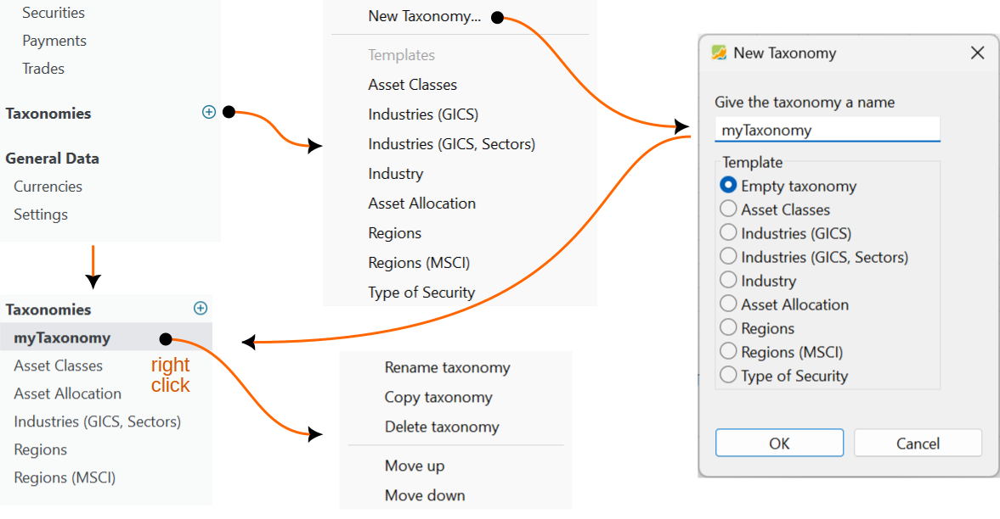
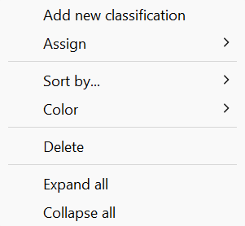

When creating a new portfolio, initially, no taxonomies are displayed in the sidebar (refer to Figure 1, top left). In theory, there is no restriction on the number of taxonomies that can be added. However, in most cases, two or three taxonomies should be sufficient. These taxonomies will be listed not only in the sidebar but also in the `View` menu.

Figure: Adding taxonomies. {class=pp-figure}

## Adding a new taxonomy

Click the green plus button :octicons-plus-circle-16: to add a new taxonomy. You can then utilize one of the [predefined templates](index.md) or create a new taxonomy (see Figure 1), which can be based on one of the existing templates. Choose `Empty taxonomy` if you want to start from scratch and define all categories and sub-categories yourself. Give the new taxonomy a descriptive name. Two taxonomies can have the same name, which is, of course, not ideal. Click "OK" to add the taxonomy in the sidebar.

The context menu of the taxonomies list allows you to rename, copy, or delete existing taxonomies. You can also rearrange the order of items in the list using the the `Move up` or `Move down` options.

## Editing a taxonomy

Selecting a taxonomy in the list will display its structure in the main pane (see Figure 2), which contains two expandable lists: one for the taxonomy's name (e.g. myTaxonomy) and another for `Without Classification`. The first list contains the categories and subcategories with their assigned securities. The second list contains all securities that have not yet been assigned to a taxonomy category.

Figure: Main pane of a taxonomy. {class=pp-figure}

In Figure 2, both lists are expanded. The `myTaxonomy` list contains two categories `Base currency` and `Foreign currencies` with appropriate securities assigned. The list `Without Classification` contains all unassigned securities. Please note that you **cannot** assign a security to more than one category.

Figure: Context menu. {class=align-right style="width:20%"}

If you selected an empty taxonomy, you must first add categories and subcategories before assigning securities to them. Use the `Add new classification` context menu to create a new classification (see Figure 3).  If you select a subcategory, the new classification will be added within it. You can delete a selected category or list using the context menu.

Selected lists can be sorted by: `Type and Name`, `Type and Actual Value`, `Name`, or `Actual Value`. As shown in Figure 2, each taxonomy category has an assigned color, which can be changed using the context menu.

To expand a category list, click the :fontawesome-solid-angle-right: icon to the left of it, which will change to a :fontawesome-solid-angle-down: icon. Click the downward-pointing caret to collapse the list. To expand or collapse all categories at once, use the context menu and select `Expand all` or `Collapse all`. 

