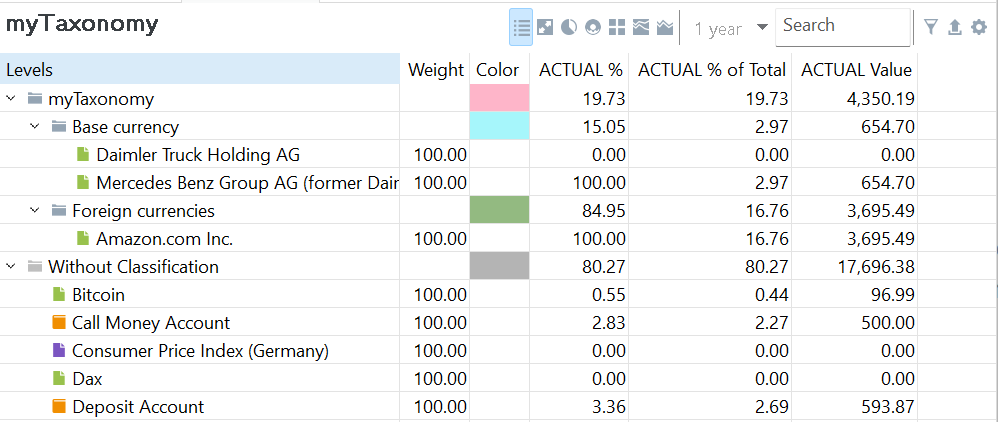
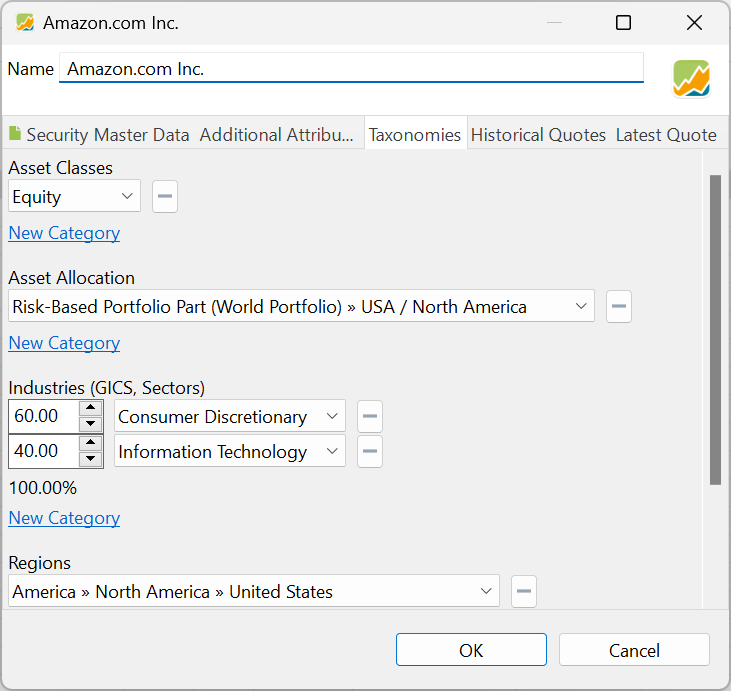

When creating a new portfolio, initially, no taxonomies are displayed in the sidebar (refer to Figure 1, top left). In theory, there is no restriction on the number of taxonomies that can be added. However, in most cases, two or three taxonomies should be sufficient. These taxonomies will be listed not only in the sidebar but also in the `View` menu.

Figure: Adding taxonomies. {class=pp-figure}

## Adding a new taxonomy

Click the green plus button :octicons-plus-circle-16: to add a new taxonomy. You can then utilize one of the [predefined templates](index.md) or create a new taxonomy (see Figure 1), which can be based on one of the existing templates. Choose `Empty taxonomy` if you want to start from scratch and define all categories and sub-categories yourself. Give the new taxonomy a descriptive name. Two taxonomies can have the same name, which is, of course, not ideal. Click "OK" to add the taxonomy in the sidebar.

The context menu of the taxonomies list allows you to rename, copy, or delete existing taxonomies. You can also rearrange the order of items in the list using the the `Move up` or `Move down` options.

## Editing a taxonomy

Upon selecting a taxonomy from the sidebar list, its structure will be displayed in the main pane (refer to Figure 2). This main pane contains two expandable lists: one for the assigned assets, which typically, but not always, shares the same name as the taxonomy (e.g., "myTaxonomy"), and another for the unassigned assets, labeled as `Without Classification`. The first list contains the categories and subcategories with their assigned assets and could be initially empty. The second list contains an alphabetically sorted list of securities and deposit accounts that have not yet been assigned to a taxonomy category.

Figure: Main pane of a taxonomy. {class=pp-figure}

In Figure 2, both lists are expanded. The `myTaxonomy` list contains two categories `Base currency` and `Foreign currencies` with appropriate securities assigned. The list `Without Classification` contains all unassigned securities. Please note that you **cannot** assign a security to more than one category.

Figure: Context menu. {class=align-right style="width:20%"}

If you selected an empty taxonomy, you must first add categories and subcategories before assigning securities to them. Use the `Add new classification` context menu to create a new classification (see Figure 3).  If you select a subcategory, the new classification will be created within it. The categories can be reordered by simply dragging and dropping them to a new location. To delete a selected category or list, use the context menu.

Selected lists can be sorted by: `Type and Name`, `Type and Actual Value`, `Name`, or `Actual Value`. As shown in Figure 2, each taxonomy category has an assigned color, which can be changed using the context menu.

To expand a category list, click the :fontawesome-solid-angle-right: icon to the left of it, which will change to a :fontawesome-solid-angle-down: icon. Click the downward-pointing caret to collapse the list. To expand or collapse all categories at once, use the context menu and select `Expand all` or `Collapse all`. 

## Adding securities

Taxonomies are created to classify assets into categories, allowing you, as a portfolio manager, to have a clear understanding of your portfolio's structure. To achieve this, securities must be added or assigned to appropriate categories and subcategories, comparable to adding a tag to a document for grouping purposes.

Figure: Context menu. {class=align-right style="width:50%"}

Securities can be assigned to a category in three ways:

- **Drag & Drop**: Select the security from the 'Unclassified' list and drag it to the correct category or subcategory within your taxonomy at the top. If a category is collapsed and thus not visible, dragging the security over the parent category will highlight it with a light blue background and a black line underneath. After a moment, the category will automatically expand. You can then drop the security into the desired category or repeat the process for a deeper categorization. If your taxonomy contains many categories and/or assets, it may be more efficient to expand the entire taxonomy beforehand.

- **Context menu**: Right-click on a category within your taxonomy and select `Assign` from the context menu. A list of available assets will appear, from which you can choose the appropriate security to assign to that category.

 

- **Edit the security**: Only available for securities (no indexes, deposit accounts, ...). Right-click a security in whatever view. This can be the `Without Classification` list or even the `All Securities` view. Choose `Edit` from the context menu. In the tab `Taxonomies`, you can add the security to one or more taxonomies. As shown in Figure 4, the Daimler Truck security is added to a few predefined taxonomies, but also to the Base Currency category of our newly created MyTaxonomy.