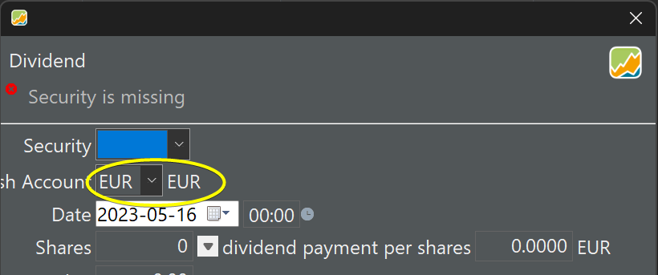

## List of known issues, todo's, questions and suggestions

### 2023-09-10 (issue)
Some screenshots contain text fields that are not aligned (see figure below). These misalignments can occur in title boxes, buttons, labels (Windows 11).



This issue seems to be related with the changing of the default font (`Help > Settings > Presentation > Formatting > Font size`). Setting it to 9px (Default) removes the issue.

### 2023-09-10 (question)
Images are stored in a subdirectory of the one where the md file resides.
``` 
concepts
   account.md
   images
      pic1.png
```
What is the correct way to reference this image?

```
1.
2.
```

(1) seems to work, both in the texteditor (VSCode) and the website. However, the path at the website is `` (1) is used at this moment.

(2) does not show the image in the texteditor preview but appears normally on the website. (2) is also needed is referencing the img in HTML.

### 2023-09-13 (suggestion implemented)

The mkdocs material frontmatter can contain several key-value pairs. It seems that only the title is taken into account for the material theme.

The frontmatter could contain other valuable info (already implemented)

- lastUpdate: YYYY-MM-DD
- todo: info about things todo on this page.

### 2023-09-16 (question)
Upon creating a security, you can specify a Calendar in the Security Master Data.

(1) What is this calendar used for?. According to the tooltip: These dates will affect some calculations, the display of price gaps and the execution of saving plans.  Which calculations? Does it matter for performance calculations?

(2) The content of these calendars is visible in `Help > Preferences > Calendar`. Can this be changed? Custom calendar?

(3) What's the difference between the `Apply` and `Apply and close` in the panel `Help > Preferences > Calendar`. Necessary?

### 2023-09-16 (question)
At the moment there is a top-level menu item called "Tips & tricks". Isn't this too informal? Replacing with "Advanced topics"?

Also the top-level item "Common procedures" may seem too generic. Other suggestions?

### 2023-09-17 (info)
Images are added with mkdocs plugin [MkDocs Caption](https://pypi.org/project/mkdocs-caption/). This plugin will put the image within a Figure HTML-element and will add a caption based on the Alt-field (between brackets). This caption will be auto-numbered as Figure 1, Figure 2, ...

Some customizations are possible. Still need to figure out how to style a right-aligned image. The author has fixed the problem to give a custom class to the figure-element. Styling is now easy.

Before I used the markdown extension [markdown-captions](https://github.com/evidlo/markdown_captions)

### 2023-09-18 (info)
There was a question about a kind of styleguide for the PP manual. Maybe we can use the APA styleguide as reference. For example, the caption of a figure should be placed on top of the figure with label Figure 1. Normally the caption itself should be at the next line in bold or italic.
Partially implemented it with the mkdocs-caption plugin.

### 2023-09-19
There should be a small but representative example portfolio on which the manual is based. This example could start from (real/anonymised) bank notes for representative securities:

- shares (EUR, GBX and USD to illustrate exchange rate and GBX). Which companies should we choose? Bayer, Nvidia, Rio Tinto?
- bonds: ?
- funds: something that should be available on morningstar, Robecco?
- trackers/ETF: tracker for gold?
- other?

Historical prices from different sources should be available. The purchase could start in 2020, january. Between then and now there should be events: such as (partial) sell, buy more, dividend payment, choice dividend (DRIP?), split, merger, other?

The example portfolio must be small and comprehensible for a beginner.

Other requirements?

### 2023-09-23
How to manage images for the EN-site? At the moment, the images were saved close to the chapter/folder they belong, e.g. concepts/images, getting-started/images, ... The naming convention was: page-name + image-description, where page-name is the page where the image is used: `irr-example-performance-reporting-period-1y.png`

Another approach is to collect all images of the EN-site into one folder en/images. Because there will be a lot of images, a workable naming convention should be followed.

path-to-image-from-UI + image-description

The name for the above example should be:
`sb-reports-performance-1yr_irr-example.png` (sb stands for sidebar)

### 2023-09-27
Upgraded to the newest versions:
mkdocs == 1.5.3
mkdocs-material == 9.4.2
mkdocs-caption == 0.0.9

### 2023-09-28
Refering to a header in another page doesn't seem to work. For example: 
[convert](deposit.md#transferbetweentwocurrencies) will jump to the correct page but not the header. The TOC extension is activated.
